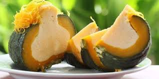

# Sangkhya Lapov

*Cambodian pumpkin custard steamed inside a whole pumpkin: coconut milk, palm sugar and eggs poured into a hollowed kabocha and steamed until the custard sets and the pumpkin flesh softens. Cut into wedges; the layered pumpkin and custard slice together. A celebration dessert across Khmer New Year.*

**Serves:** 6-8

**Prep Time:** 20 minutes

**Cook Time:** 1¼ hours

## Overview
A small kabocha or buttercup pumpkin has its top cut off and seeds scooped out. A custard of coconut milk, palm sugar, eggs and a pinch of salt fills the cavity. The pumpkin (top replaced) sits in a steamer over boiling water and steams 1 hour or so until the custard is set. Slice in wedges to serve.

## Ingredients

- 1 small kabocha or buttercup pumpkin (around 1.5 kg)
- 5 large eggs
- 250 ml thick coconut milk (or coconut cream)
- 200 g palm sugar (or brown sugar)
- ½ teaspoon salt
- 1 teaspoon vanilla extract (optional)
- A few pandan leaves (knotted) — optional but classic

## Method

### Stage 1 – Prep the pumpkin
1. Cut off the top of the pumpkin in a wide circle (around 12 cm across) — this is your lid; save it.
1. Scoop out the seeds and stringy flesh.
1. Wipe the cavity dry with kitchen paper.

### Stage 2 – Custard
1. Warm the coconut milk and palm sugar gently in a small pan with the salt and pandan leaves until the sugar dissolves; cool to lukewarm; remove the pandan.
1. Whisk the eggs in a bowl until smooth (don't froth).
1. Strain in the warm coconut milk; whisk gently to combine; add the vanilla if using.
1. Pour the mixture into the pumpkin — fill to about 1 cm below the rim.

### Stage 3 – Steam
1. Set the pumpkin (lid on) on a heatproof plate inside a large steamer (or a deep roasting pan with a wire rack, lid sealed with foil) over boiling water.
1. Steam 60-75 minutes — top up the water as it boils away. The custard is set when a knife inserted comes out clean.
1. The pumpkin flesh underneath should yield easily to a knife (similar to roast pumpkin).

### Stage 4 – Cool and slice
1. Lift the pumpkin out carefully; cool 30 minutes.
1. Refrigerate at least 2 hours before slicing — gives clean, layered wedges.
1. Cut from the top: each wedge has a layer of pumpkin and a layer of custard.

## Notes
- **Choose a small pumpkin:** Larger ones don't fit a domestic steamer; the custard takes longer. 1.2-1.5 kg is ideal.
- **Strain the custard:** Removes any chalazae (the white string in egg whites) and gives a silkier set.
- **Don't over-steam:** Once set, more steaming makes the custard weep. The knife test is the only test.

## Storage
- Keeps 3 days refrigerated; eats cold or at room temperature.
- Doesn't freeze well.
