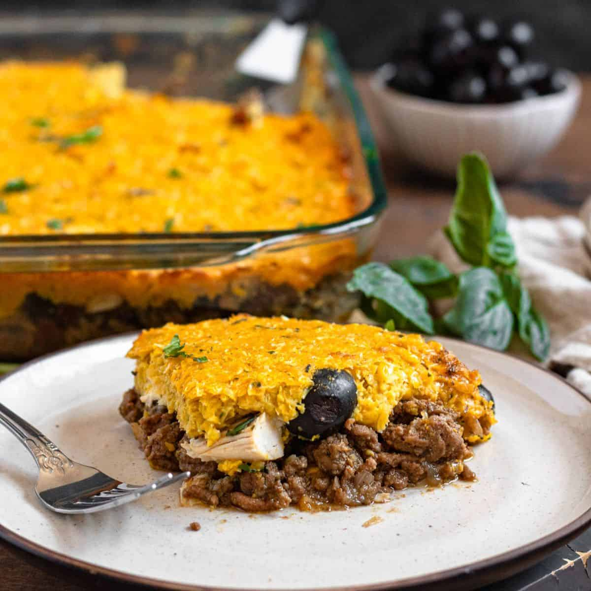

# Pastel de Choclo

*Chile's "corn cake": a deep dish layered with spiced beef pino (mince, onion, raisins, olives), shredded chicken, hard-boiled egg, and a sweet creamy corn topping that bakes to a crackling sugared crust. Eaten in summer when corn is at its best; served with a Chilean salad alongside. Sweet, savoury and slightly smoky all in one bowl.*

**Serves:** 6

**Prep Time:** 40 minutes

**Cook Time:** 1¼ hours

## Overview
Pino (the beef-onion mince base) cooks first: onions soften slowly with cumin, paprika and oregano; mince browns in; raisins, olives and a splash of stock simmer everything to a moist filling. Chicken pieces poach separately and shred. The corn topping blends fresh sweet corn (or kabocha-corn mix in winter) with milk, butter and basil into a thick batter. Layer in clay dishes (or one large baking dish): pino, chicken, hard-boiled egg slices, corn batter on top. A heavy dust of sugar makes the top crisp under the grill.

## Ingredients

### Beef pino
- 3 tablespoons vegetable oil
- 3 large onions (finely chopped)
- 6 garlic cloves (crushed)
- 600 g beef mince (15-20% fat)
- 2 teaspoons ground cumin
- 1 teaspoon sweet smoked paprika
- 1 teaspoon dried oregano
- 1 teaspoon salt
- ½ teaspoon black pepper
- 100 ml beef stock
- 80 g raisins (soaked 10 min in hot water)
- 100 g pitted black olives (Kalamata or Botija; halved)

### Chicken
- 4 chicken thighs (bone-in)
- 1 small onion (quartered)
- 1 bay leaf
- 500 ml water
- 1 teaspoon salt

### Corn topping
- 800 g sweet corn kernels (fresh from 6-8 cobs, or thawed frozen)
- 200 ml whole milk
- 50 g unsalted butter
- 4 tablespoons fresh basil leaves (chopped)
- 1 teaspoon salt
- 2 tablespoons cornflour mixed with 3 tablespoons cold water

### To assemble
- 4 hard-boiled eggs (sliced)
- 3 tablespoons caster sugar (for the top)

## Method

### Stage 1 – Pino
1. Heat the oil in a wide heavy pan over medium heat.
1. Cook the onions 12-15 minutes until soft and golden.
1. Add the garlic; cook 1 minute.
1. Add the mince; cook 8 minutes, breaking it up, until well browned.
1. Stir in the cumin, paprika, oregano, salt and pepper.
1. Add the stock; simmer 10 minutes until almost dry.
1. Stir in the drained raisins and olives. Cool slightly.

### Stage 2 – Chicken
1. Place the chicken in a small pan with the onion, bay, water and salt.
1. Bring to a simmer; cook 25 minutes.
1. Lift the chicken out; cool slightly; pull the meat from the bones into shreds.

### Stage 3 – Corn topping
1. Blend the corn kernels, milk and basil to a coarse purée — leave some texture.
1. Pour into a wide pan; melt in the butter; bring to a steady simmer over medium heat.
1. Stir in the salt and the cornflour slurry.
1. Cook 6-8 minutes, stirring constantly, until thickened to a porridge consistency.

### Stage 4 – Assemble
1. Heat the oven to 200°C (180°C fan).
1. Spread the pino across the bottom of a 30 x 20 cm baking dish (or 6 individual clay pasteleras).
1. Lay the shredded chicken evenly over the pino.
1. Arrange the hard-boiled egg slices across the top.
1. Pour the corn topping over and spread to the edges.
1. Sprinkle the sugar evenly across the top.

### Stage 5 – Bake
1. Bake 25-30 minutes until the corn topping is set and lightly golden.
1. Switch to grill (broil) for 3-4 minutes, watching closely, until the sugar caramelises into a crackly mahogany crust.

### Stage 6 – Rest and serve
1. Rest 10 minutes (the layers settle).
1. Serve hot, scooping down through all the layers.
1. Pair with Chilean salad (tomato + onion + coriander) and a glass of cold red wine.

## Notes
- **Sugar on top is essential:** The caramelised crackle is the signature finish — without it the dish tastes flat. Don't skimp.
- **Fresh corn vs frozen:** Fresh in season is unbeatable. Frozen is a workable year-round substitute. Tinned is too watery.
- **Clay dishes:** Traditional pastel de choclo bakes in individual clay pasteleras (paila in Chile). Worth seeking out if you cook this often; one large dish works fine.

## Storage
- Keeps 3 days refrigerated; reheat covered at 180°C with a fresh sugar dust on top to revive the crackle.
- Freezes 2 months unbaked.
