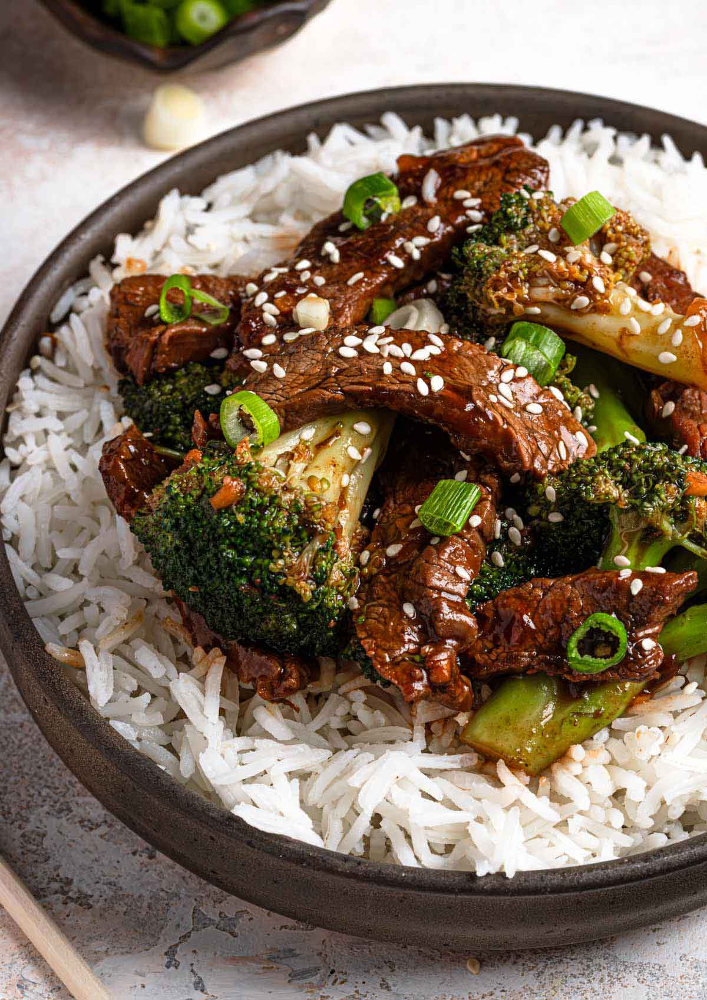

# Beef and Broccoli

*Cantonese-American takeaway classic: thinly sliced beef stir-fried with broccoli in a glossy soy-oyster sauce. Fifteen minutes start to finish; the kind of weeknight dinner that beats a ten-quid takeaway and tastes more like home.*

**Serves:** 4

**Prep Time:** 15 minutes

**Cook Time:** 10 minutes

## Overview
Sliced beef velvets briefly in cornflour and soy, broccoli florets blanch to bright green, and the lot stir-fries hard with garlic and ginger in a soy-oyster-rice-wine sauce. Served over steamed rice.

## Ingredients

### Beef
- 500 g rib-eye, sirloin or rump (sliced thin against the grain)
- 1 tablespoon soy sauce
- 1 tablespoon Shaoxing rice wine (or dry sherry)
- 1 tablespoon cornflour
- 1 teaspoon sugar

### Sauce
- 4 tablespoons oyster sauce
- 2 tablespoons soy sauce
- 1 tablespoon Shaoxing rice wine
- 1 teaspoon sugar
- 1 teaspoon toasted sesame oil
- 100 ml chicken stock or water
- 1 teaspoon cornflour

### Stir-fry
- 1 head broccoli (cut into florets, stems peeled and sliced)
- 3 tablespoons vegetable oil
- 4 garlic cloves (crushed)
- 1 thumb fresh ginger (grated)
- 4 spring onions (cut into 4 cm pieces)
- Cooked rice, to serve

## Method

### Stage 1 – Marinate the beef
1. Toss the sliced beef with the soy, rice wine, cornflour and sugar.
1. Let sit while you prep the rest.

### Stage 2 – Sauce
1. Whisk all sauce ingredients in a small bowl.

### Stage 3 – Blanch broccoli
1. Bring a pot of water to the boil; salt lightly.
1. Blanch the broccoli for 90 seconds; drain and refresh under cold water (locks in colour).

### Stage 4 – Stir-fry
1. Heat 2 tablespoons of oil in a wok over high heat until smoking.
1. Add the beef in a single layer; sear 1 minute, then stir-fry 1 minute more. Remove.
1. Add the remaining oil; stir-fry the garlic, ginger and white parts of the spring onion for 30 seconds.
1. Add the broccoli; toss for 1 minute.
1. Return the beef; pour in the sauce.
1. Toss vigorously for 1-2 minutes until the sauce thickens and coats everything.
1. Stir in the spring onion greens.

### Stage 5 – Serve
1. Plate over rice.

## Notes
- **Slice beef thin and against the grain:** The single biggest factor in tenderness for stir-fries.
- **Smoking-hot wok:** Wok hei (the breath of the wok) is the smoky char on the ingredients. Mid-temperature gives a wet stew.
- **Blanch the broccoli:** Stir-fry alone keeps it raw in the centre; pre-blanching gives the bright bite.

## Storage
- Best fresh. Keeps 1 day refrigerated; reheat in a hot pan with a splash of water.
