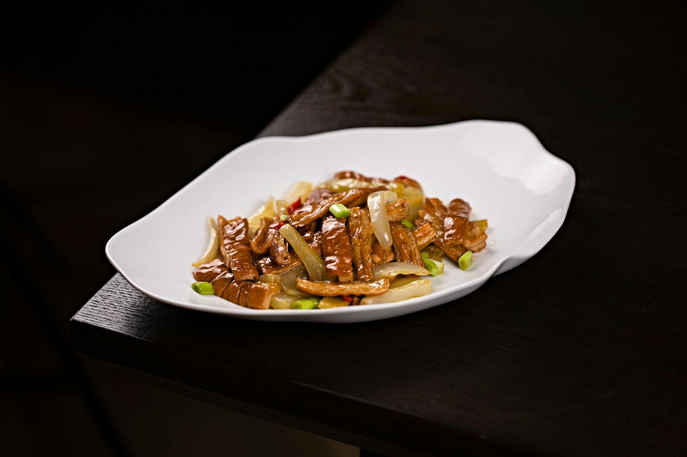

# Beef in Oyster Sauce

*A classic Cantonese dish that showcases the harmonious balance between tender beef and umami-rich oyster sauce. This recipe demonstrates the fundamental Chinese cooking principle of high-heat wok cooking, where speed and precision create dishes with vibrant flavours and succulent textures.*

**Serves:** 4

## Overview
A quick and elegant stir-fry that balances savoury oyster sauce with tender beef. This dish exemplifies the Chinese technique of high-heat cooking to seal flavours while keeping meat moist. Quality oyster sauce is essential, it should deepen the dish rather than dominate it.

## Ingredients

### Beef & Marinade
- 350 grams lean beef steak (thinly sliced)
- 2 teaspoons light soy sauce
- 2 teaspoons dry sherry or rice wine
- 1 teaspoon cornflour

### Sauce
- 1½ tablespoons groundnut oil
- 70 ml Chinese chicken stock
- 1½ tablespoons oyster sauce
- 1 teaspoon cornflour (mixed with 1 teaspoon water)

### Garnish
- 1½ tablespoons spring onions (finely chopped)

## Method

### Stage 1 – Prepare & Marinate
1. Cut the beef into thin slices, about 5 cm long.
1. Add the soy sauce, sherry or rice wine and cornflour.
1. Leave to marinate for 20 minutes.

### Stage 2 – Stir-Fry Beef
1. Heat the oil in a wok or large frying pan until it is very hot and almost smoking.
1. Stir-fry the beef slices until cooked, then remove and drain on kitchen paper.

### Stage 3 – Make Sauce
1. Wipe the wok clean and re-heat it over a high heat.
1. Add the chicken stock and oyster sauce.
1. Bring the liquid to the boil, then add the cornflour mixture and simmer for 2 minutes.

### Stage 4 – Finish
1. Return the drained beef to the pan and coat all the slices thoroughly with the sauce.
1. Turn onto a serving platter and garnish with spring onions. Serve at once.

## Notes
- **Oyster sauce quality:** Use a good quality oyster sauce that does not taste of fish. It should complement, not overpower the beef.
- **High-heat stir-frying:** Essential to seal the meat and keep it tender. Do not overcrowd the wok.
- **Cornflour slurry:** Binding the cornflour with water before adding prevents lumps and creates a smooth sauce.
- **Beef slicing:** Slightly frozen beef is easier to slice thinly and uniformly.

## Serving
Serve with: Steamed rice and Chinese leaves in soy sauce
Garnish with: Finely chopped spring onions

## Variations
**Beef with Broccoli:** Replace the oyster sauce with 2 tablespoons soy sauce. Add 200g broccoli florets, stir-fried separately and combined with the beef.
**Beef with Mushrooms:** Add 150g sliced mushrooms (shiitake or button) stir-fried with the beef for earthy richness.
**Spicy Beef Oyster Sauce:** Add 1-2 teaspoons of chilli oil or ½ teaspoon of dried chilli flakes to the sauce.

## Storage
- Keeps 2-3 days refrigerated
- Not recommended for freezing (beef texture may become tough upon thawing)
- Best served immediately or within a few hours of preparation