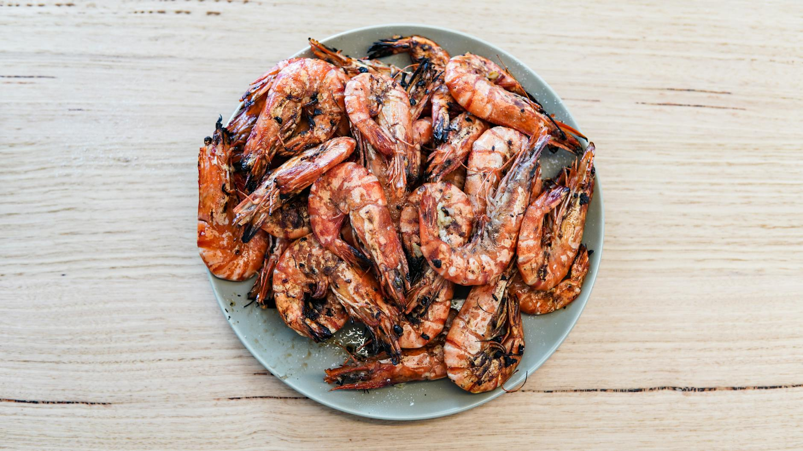

# Braised Prawns

## Overview
A simple, elegant preparation favoured by street vendors throughout southern China. This quick-braising method takes only minutes and produces tender, fragrant prawns. The beauty of this dish lies in its simplicity, fresh ginger and spring onions infuse the delicate sweetness of prawns. Equally delicious served hot immediately or chilled for an exotic picnic dish.

**Serves:** 4

## Ingredients

### Protein
- 225 grams prawns (shelled and de-veined)

### Braising Sauce
- 1½ tablespoons spring onions (finely chopped)
- 2 teaspoons fresh ginger (finely chopped)
- 1 tablespoon dry sherry or rice wine
- 1 tablespoon light soy sauce
- 70 ml Chinese chicken stock

## Method

### Stage 1 – Prepare
1. Wash and pat dry the prawns on kitchen paper.

### Stage 2 – Build Braising Sauce
1. Combine the braising sauce ingredients together in a wok or large saucepan and bring to the boil.
1. Turn the heat down low and simmer for 2 minutes.

### Stage 3 – Braise Prawns
1. Add the prawns and stir, mixing them in well.
1. Cover the pan and braise for 2 minutes.
1. Serve at once or allow to cool and serve cold.

## Notes
- **Prawn quality:** Use fresh, high-quality prawns for best results. Frozen prawns should be thawed and well-drained.
- **Quick cooking:** Prawns cook very fast, overcooking makes them rubbery. The 2-minute braise is sufficient for most medium prawns.
- **Versatile serving:** Equally excellent served hot as a quick stir-fry or chilled as a starter or picnic dish.
- **Aromatics:** Fresh ginger and spring onions are essential, don't skip these for the fragrant, authentic flavour.

## Serving
Serve hot with: Steamed rice
Serve cold as: A starter or light picnic dish

## Storage
- Keep 1-2 days refrigerated
- Serve cold within a few hours for best texture (prawns can become rubbery if refrigerated too long)
- Not recommended for freezing (prawns lose texture quality)