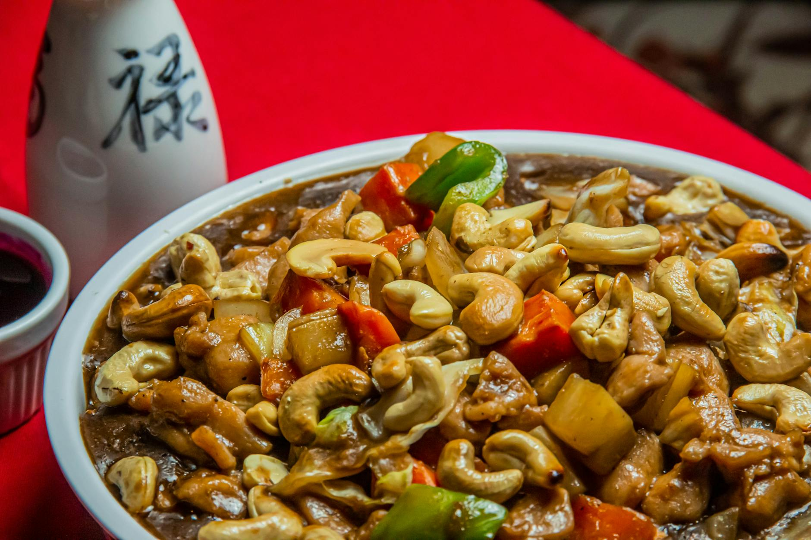

# Cashew Chicken

## Overview
This dish exemplifies the Chinese penchant for contrasting textures. Tender succulent pieces of chicken are paired with sweet, crunchy cashew nuts and a delicate sauce. While the original Chinese version would have used peanuts (as cashews were not traditionally featured in Chinese cookery), this adaptation showcases how the cuisine evolves while maintaining its core philosophy of textural harmony.

**Serves:** 4

## Ingredients

### Chicken & Coating
- 225 grams boneless chicken breasts (skinned)
- 1 egg white
- 1 teaspoon salt
- 1 teaspoon cornflour

### Cooking & Sauce
- 150 ml groundnut oil
- 50 grams cashew nuts
- 2 teaspoons dry sherry or rice wine
- 1 tablespoon light soy sauce

### Garnish
- 1 tablespoon spring onions (finely chopped)

## Method

### Stage 1 – Prepare & Coat
1. Cut the chicken breasts into 1 cm cubes.
1. Combine them with the egg white, salt and cornflour in a small bowl.
1. Refrigerate for about 20 minutes so that the flavours combine.

### Stage 2 – Cook Chicken
1. Heat the oil in a wok or deep frying pan until moderately hot.
1. Add the chicken mixture and stir-fry quickly in the oil to keep it from sticking.
1. Cook until it turns white, which should take about 2 minutes.
1. Drain the chicken cubes in a colander, reserving 1 tablespoon of the oil.

### Stage 3 – Finish
1. Clean the wok and return the reserved oil to it.
1. Re-heat the wok until very hot.
1. Add the cashew nuts, sherry, soy sauce and cooked chicken.
1. Stir-fry the mixture for 2 minutes.
1. Turn out onto a platter and garnish with spring onions.

## Notes
- **Textural contrast:** The interplay of tender chicken, crunchy nuts, and silky sauce is essential. Don't over-cook the chicken.
- **Cashew nuts:** Use roasted, unsalted cashews for best flavour. Add late to maintain crunch.
- **Egg white coating:** Creates a silky exterior. Don't skip the 20-minute rest period.

## Serving
Serve with: Steamed rice and a simple stir-fried vegetable

## Storage
- Best served immediately for optimal texture contrast
- Keeps 1-2 days refrigerated (nuts may lose crispness)
- Not recommended for freezing