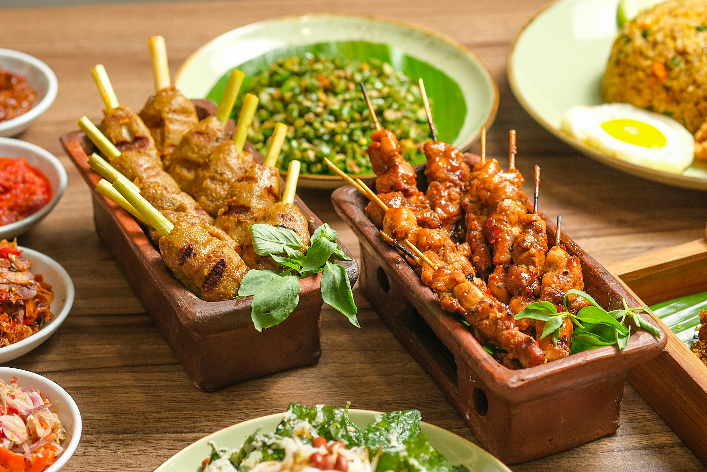

# Chicken and Peanut

## Overview
When cooking Chinese food, it's essential to think about the flavours and textures of ingredients working in harmony. Juicy chicken combined with succulent baby corn, tender vegetables, and salty, crunchy cashew nuts create a balanced dish where each element complements the others. A glossy sauce ties everything together without overwhelming delicate flavours.

**Serves:** 2

## Ingredients

### Aromatics & Protein
- 1 tbsp groundnut oil
- 3 garlic cloves (crushed)
- 1/2 tsp fresh ginger (finely chopped)
- 2 chicken breast fillets (sliced)

### Vegetables
- 1 onion (roughly chopped)
- 1 carrot (finely diced)
- 40g tinned water chestnuts (sliced into bite-sized discs)
- 30g tinned bamboo shoots
- 3 baby corn cobs (cut into bite-sized pieces)

### Sauce & Finish
- 2 tbsp oyster sauce
- 1 tbsp dark soy sauce
- 80ml chicken stock
- 1/4 tsp salt
- 1/4 tsp white pepper
- 1 tbsp cornflour (mixed with 2 tbsp water)
- 30g salted, roasted cashew nuts
- 1 tsp sesame oil

## Method

### Stage 1 - Aromatics & Chicken
1. Place a wok over medium-high heat and add the groundnut oil, garlic and ginger.
1. Fry for about 30 seconds until fragrant.
1. Add the chicken and stir-fry for 2 minutes.

### Stage 2 - Add Vegetables
1. Add the onion, carrot, water chestnuts, bamboo shoots and baby corn.
1. Stir-fry for a further 2 minutes.

### Stage 3 - Build Sauce
1. Spoon in the oyster sauce and soy sauce.
1. Pour in the stock and add salt and pepper.
1. Stir well and bring to the boil.
1. Turn down to simmer for 2 minutes.

### Stage 4 - Thicken & Finish
1. Pour in the cornflour mixture, stirring as you do.
1. Remove from the heat.
1. Add the cashew nuts and sesame oil and mix well.
1. Transfer to a serving dish.

## Notes
- **Textural harmony:** Tinned water chestnuts and bamboo shoots add authentic crunch. Their texture is essential to the dish.
- **Cornflour timing:** Add just before finishing to achieve a glossy sauce without over-thickening.
- **Sesame oil finish:** Adds fragrant authenticity at the very end.

## Serving
Serve with: Steamed white rice

## Storage
- Best served immediately for texture contrast
- Keeps 1 day refrigerated (vegetables may soften)
- Not recommended for freezing