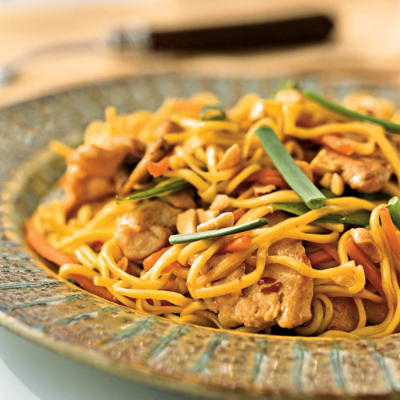

# Chow Mein

## Overview
Chow mein literally means 'stir-fried noodles' and this contemporary dish is equally popular throughout southern China as it is worldwide. Fresh egg noodles are quickly stir-fried with protein and vegetables, creating a harmonious balance of textures and flavours. The keys to success are properly cooked noodles, high-heat wok cooking, and precise timing.

**Serves:** 4

## Ingredients

### Noodles
- 225 grams fresh egg noodles

### Chicken & Marinade
- 100 grams chicken breast (skinned)
- 2 teaspoons light soy sauce
- 2 teaspoons dry sherry or rice wine
- 2 teaspoons groundnut oil

### Stir-Fry
- 1 tablespoon groundnut oil
- 1 teaspoon garlic (finely chopped)
- 50 grams mange tout (trimmed)
- 25 grams Parma ham (sliced)
- 1 teaspoon light soy sauce
- ½ teaspoon sugar
- 1 tablespoon spring onions (finely chopped)
- 1 teaspoon sesame oil

## Method

### Stage 1 – Cook Noodles
1. Boil the noodles for 3-5 minutes and immerse in cold water.
1. Drain thoroughly, shaking off as much excess water as possible and set aside.

### Stage 2 – Prepare & Cook Chicken
1. Using a sharp knife, slice the chicken breast into fine 5 cm long shreds.
1. Combine the chicken shreds with the 2 teaspoons of soy sauce, sherry and 2 teaspoons oil in a small bowl.
1. Let the chicken marinate for about 10 minutes.
1. Heat a wok or large frying pan and add the marinated chicken shreds.
1. Stir-fry for about 2 minutes until cooked, then transfer to a plate.

### Stage 3 – Stir-Fry Vegetables
1. Clean the wok or pan and re-heat it.
1. Add 1 tablespoon of oil and garlic.
1. Stir-fry for about 10 seconds, then add the mange tout and Parma ham.
1. Stir-fry for 1 minute.

### Stage 4 – Combine & Finish
1. Add the noodles, 1 teaspoon soy sauce, sugar and spring onions to the wok.
1. Continue to stir-fry for about 2 minutes.
1. Return the chicken to the noodle mixture.
1. Continue to stir-fry for 3-4 minutes until everything is heated through and well combined.
1. Add the sesame oil and give the mixture a few final stirs.
1. Serve at once.

## Notes
- **Noodle texture:** Fresh egg noodles provide the best texture, they should be cooked to just al dente, cooled, and well-drained to prevent a soggy dish.
- **High-heat wok cooking:** Essential to prevent noodles from sticking and to maintain texture. Keep ingredients moving constantly.
- **Timing:** The entire cooking process should be quick, once noodles are added, finish within minutes to maintain texture and heat.
- **Sesame oil finish:** Added at the very end, it provides authentic fragrance and flavour.

## Serving
Serve with: A simple vegetable side or light soup to balance the richness

## Storage
- Best served immediately for optimal texture
- Keeps 1 day refrigerated (texture will soften)
- Not recommended for freezing (noodles become mushy)