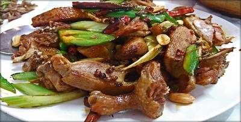

# Crispy Sichuan Duck

## Overview
In China, duck is a special occasion treatment reserved for banquets and celebrations. Don't be intimidated by the preparation, most steps are straightforward and can be done a day ahead. The technique is masterful: steaming renders out most of the fat, leaving meat moist and succulent, while deep-frying creates a shatteringly crisp skin. The result is elegant, restaurant-quality dinner.

**Serves:** 4-6

## Ingredients

### Duck & Seasonings
- 1 whole duck
- 2 tablespoons five spice powder
- 2 tablespoons salt

### Aromatics & Finishing
- 4 slices fresh ginger
- 4 spring onions
- 1 litre oil (for deep frying)

## Method

### Stage 1 – Season & Marinate
1. Rub the inside and outside of the duck with the five spice powder and salt, ensuring it's rubbed on evenly.
1. Wrap the duck in cling-film and place in the refrigerator for at least 3 hours, preferably overnight, to allow flavours to infuse.

### Stage 2 – Stuff & Prepare
1. Cut the ginger and spring onions into thin slices.
1. Stuff them into the cavity of the duck.
1. Place the duck on a heatproof plate.

### Stage 3 – Steam
1. Set up a steamer or put a rack into a wok or deep pan.
1. Pour about 5 cm of water into the pan and bring to the boil.
1. Put the duck and plate into the steamer, cover with a lid and steam gently for 2 hours.
1. Replenish the water from time to time to keep the steam constant.
1. Remove the duck and pour off all fat and liquid that has accumulated.
1. Discard the ginger and spring onions.
1. Keep the duck on a platter in a cool, dry place for about 2 hours until thoroughly dried and cooled. (At this point, the duck can be refrigerated for up to 24 hours.)

### Stage 4 – Deep-Fry
1. Cut the duck into quarters.
1. Heat the oil in a deep-fat fryer or large wok.
1. When the oil is almost smoking, deep-fry the duck quarters in 2 batches until each is crisp and warmed through.
1. Drain the quarters on kitchen paper and chop into smaller serving pieces.

## Notes
- **Two-stage cooking:** Steaming then deep-frying is the secret, it renders fat while maintaining succulence and achieves the ideal crispy exterior.
- **Five spice powder:** Essential for authenticity. Ensure even coating for balanced flavour.
- **Drying time:** The 2-hour cooling and drying period is crucial for achieving crispy skin in the fryer.
- **Make-ahead friendly:** Nearly all preparation can be done a day ahead; only deep-fry just before serving.

## Serving
Serve with: Mandarin pancakes, hoisin sauce, shredded cucumber and spring onions (Peking duck style), or simply with steamed rice

## Storage
- Best served immediately for optimal crispness
- Keeps 1-2 days refrigerated (skin will soften)
- Can be partially prepared (through steam stage) 1 day ahead, then deep-fried before serving
- Freezing not recommended (skin becomes tough upon thawing)