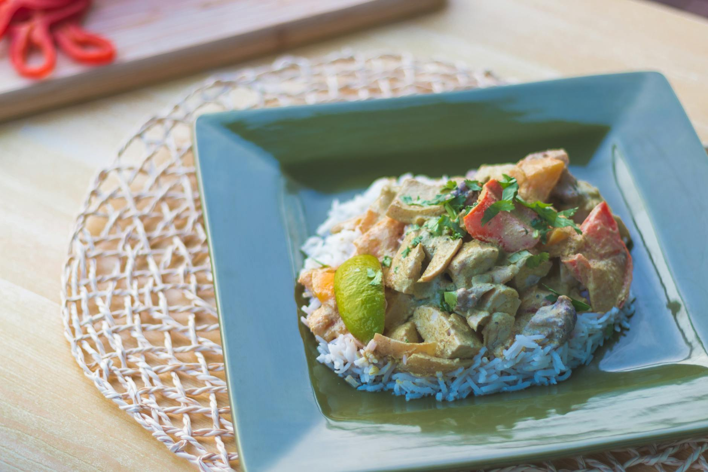

# Curried Chicken with Peppers

## Overview
Curry blends beautifully with chicken when prepared in the style of southern Chinese cuisine, as a light, subtle sauce that enhances rather than overpowers the delicate chicken meat. This recipe balances spice with refinement, proving that curry in Chinese cooking is more elegant whisper than aggressive shout.

**Serves:** 4

## Ingredients

### Chicken & Coating
- 225 grams chicken breasts (skinned)
- 1 egg white
- 1 teaspoon salt
- 1 teaspoon cornflour

### Vegetables & Cooking Oil
- 225 grams green peppers (de-seeded)
- 150 ml groundnut oil

### Sauce
- 70 ml Chinese chicken stock
- 2 teaspoons curry powder or curry paste
- 1 teaspoon sugar
- 2 teaspoons dry sherry or rice wine
- 1 tablespoon light soy sauce
- 1 teaspoon cornflour (blended with 1 teaspoon water)

## Method

### Stage 1 – Prepare & Coat
1. Cut the chicken breasts into 2 cm cubes.
1. Combine them with the egg white, salt and cornflour in a small bowl.
1. Refrigerate for about 20 minutes so that the flavours combine.

### Stage 2 – Prepare Vegetables
1. Cut the peppers into 2 cm cubes.

### Stage 3 – Cook Chicken
1. Heat the oil in a wok or large frying pan until moderately hot.
1. Add the chicken mixture and stir-fry quickly to keep it from sticking.
1. Cook until it turns white, which should take about 2 minutes.
1. Put the chicken immediately into a colander and drain off the remaining oil into a dish.

### Stage 4 – Build Sauce
1. Clean the wok and add 1 tablespoon of the drained oil.
1. Reheat the wok until very hot.
1. Add the peppers and stir-fry them for 2 minutes.
1. Add the stock, curry powder, sugar, sherry and soy sauce.
1. Cook for a further 2 minutes.
1. Pour in the cornflour mixture and stir to thicken lightly.
1. Return the chicken to the pan and stir-fry for another 2 minutes, coating thoroughly with the sauce.
1. Serve immediately.

## Notes
- **Curry in Chinese cooking:** Southern Chinese curry is distinctly different from Indian curry, it's a supporting note, not the main melody.
- **Curry powder vs. paste:** Both work; paste provides more body and depth, while powder offers subtlety.
- **Cornflour slurry:** Add late to achieve a glossy, light sauce rather than a heavy coating.

## Serving
Serve with: Steamed white rice and a simple vegetable

## Storage
- Keeps 2-3 days refrigerated
- Freezes well up to 2-3 months
- Best served the day of preparation for brightest flavour