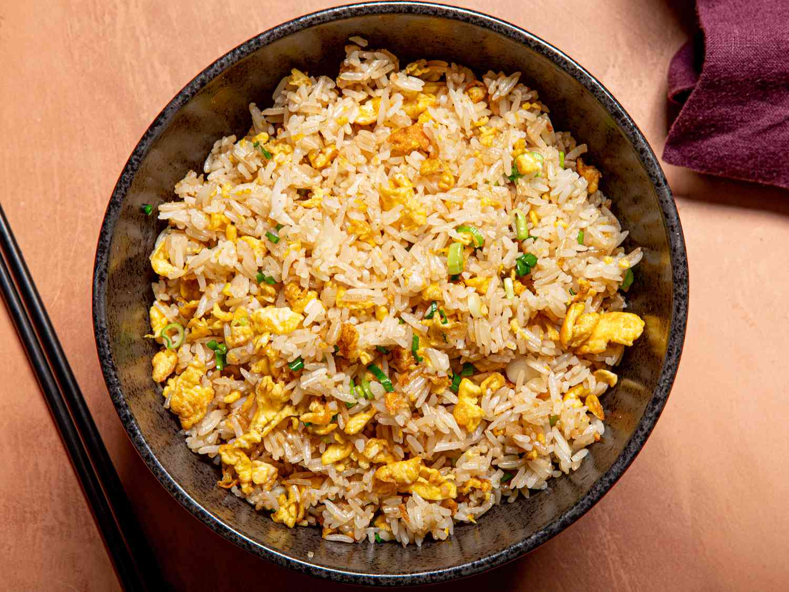

# Egg Fried Rice

*The takeaway classic done properly: day-old rice, hot wok, eggs scrambled separately, soy and white pepper. Twelve minutes from a fridge of leftovers to dinner. The trick is dry rice; freshly cooked rice goes gluey.*

**Serves:** 4

**Prep Time:** 5 minutes

**Cook Time:** 12 minutes

## Overview
Day-old refrigerated rice (or freshly cooked, then cooled and dried) tosses in a smoking-hot wok with garlic, eggs and spring onion. Soy sauce and a splash of sesame oil season the lot. The high heat gives the wok-hei smoky edge that defines proper fried rice.

## Ingredients

- 600 g cooked long-grain or jasmine rice (day-old, well chilled)
- 4 large eggs (lightly beaten)
- 3 tablespoons vegetable oil (split)
- 4 spring onions (sliced; whites and greens separated)
- 4 garlic cloves (crushed)
- 100 g cooked ham, char siu or prawns (chopped; optional)
- 2 tablespoons soy sauce
- 1 teaspoon dark soy sauce (optional, for colour)
- 1 teaspoon toasted sesame oil
- ½ teaspoon ground white pepper
- Salt to taste

## Method

### Stage 1 – Loosen the rice
1. Break up any clumps in the cold rice with your fingers (chilled rice clumps; loose grains stir-fry better).

### Stage 2 – Eggs
1. Heat 1 tablespoon of oil in a wok over high heat.
1. Pour in the beaten eggs; let them set for 10 seconds, then scramble fast with a spatula until just cooked.
1. Tip onto a plate.

### Stage 3 – Aromatics
1. Add the remaining 2 tablespoons of oil; let it smoke.
1. Stir-fry the spring onion whites, and garlic for 30 seconds.
1. Add the ham/prawns if using; stir-fry 1 minute.

### Stage 4 – Rice
1. Add the cold rice. Press into the wok to spread out, then toss vigorously with a spatula for 2-3 minutes until the grains are hot and starting to sear.
1. Pour the soy sauce around the edge of the wok (it caramelises briefly before hitting the rice; gives more flavour).
1. Add dark soy if using; toss for colour.

### Stage 5 – Combine and finish
1. Return the eggs; break them up among the rice with a spatula.
1. Add white pepper and sesame oil; toss.
1. Stir in the spring onion greens; taste; salt if needed.

### Stage 6 – Serve
1. Plate immediately while smoking hot.

## Notes
- **Day-old rice:** Critical. Freshly cooked rice is too moist; clumps and goes mushy. Cook the day before, refrigerate uncovered if possible.
- **Smoking-hot wok:** Wok hei needs heat. Cold wok = damp fried rice that tastes like school dinners.
- **Soy down the side:** Hitting the wok metal first caramelises the sauce briefly before it lands on the rice; adds depth.

## Storage
- Eat fresh. Keeps 1 day; reheat in a hot wok with a tablespoon of water to revive (microwaving turns it dry).
