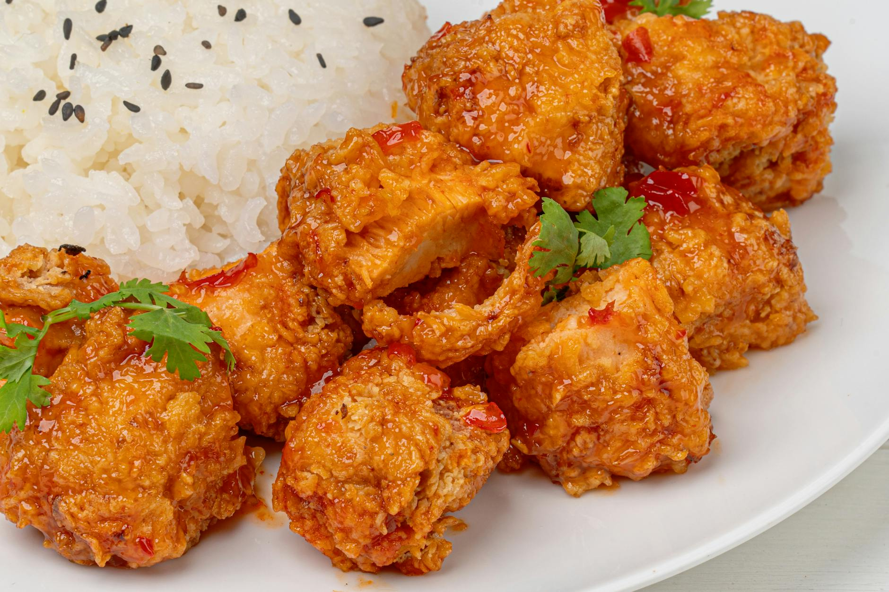

# General Tso’s Chicken

## Overview
This iconic American-Chinese dish combines deep-fried chicken with a sweet, spicy, and slightly tangy sauce. General Tso's chicken exemplifies the bold flavours of outside China Chinese cooking, where heat from dried chillies, sweetness from sugar, and complexity from vinegar create a sauce that is bold yet balanced. Restaurant-quality results require proper oil temperature and crispy, well-coated chicken.

**Serves:** 4

## Ingredients

### Chicken & Coating
- 455g boneless, skinless chicken thighs (cubed)
- 240ml rice wine
- 60ml soy sauce
- 125g flour
- 1 tablespoon salt
- 2 litres vegetable oil (for frying)

### Sauce
- 1 tablespoon vegetable oil
- 2 cloves fresh garlic (minced)
- 1 teaspoon fresh ginger (grated)
- 45g dried chili pod
- 60ml rice wine
- 60ml soy sauce
- 60ml rice wine vinegar (or white wine vinegar substitute)
- 50g sugar

### Thickener & Garnish
- 1/2 tablespoon cornstarch (mixed with 1/2 tablespoon water)
- 35g spring onion (chopped)
- White rice for serving

## Method

### Stage 1 - Marinate Chicken
1. In a large bowl, combine rice wine, soy sauce and cubed chicken thighs.
1. Stir, cover and refrigerate for at least 30 minutes or up to an hour.

### Stage 2 - Prepare Coating
1. In a separate large bowl, combine flour and salt.
1. Remove chicken from marinade and place in flour mixture.
1. Mix thoroughly until all chicken pieces are evenly coated.

### Stage 3 - Deep-Fry
1. Fill a large pot at least 5 cm deep with vegetable oil.
1. Heat oil to 185°C.
1. Place chicken pieces in frying oil, stirring occasionally.
1. Fry until golden brown, roughly 4-5 minutes.
1. Remove chicken from oil and set aside to drain on paper towels or a wire rack.

### Stage 4 - Make Sauce
1. In a large skillet, heat one tablespoon of vegetable oil over medium-high heat.
1. Add garlic and ginger, stirring frequently for one minute.
1. Add dried chili pods and continue stirring for 30 seconds.
1. Add rice wine, soy sauce, rice wine vinegar and sugar.
1. Stir occasionally until mixture is bubbling.
1. Add cornstarch slurry, stirring frequently. The sauce should thicken in a minute or less.

### Stage 5 - Combine & Serve
1. Add cooked chicken pieces, stirring them to coat with the sauce.
1. Remove from heat.
1. Garnish with green onions.
1. Serve with white rice.

## Notes
- **Oil temperature:** Critical for crispy exterior and cooked-through interior. Use a thermometer for accuracy.
- **Chicken thighs:** Provide more flavour and stay moist. Breast meat can dry out easily.
- **Dried chili peppers:** Add fruitiness and heat. Adjust quantity based on desired spiciness.
- **Cornstarch slurry:** Ensures smooth, glossy sauce without lumps.

## Serving
Serve with: Steamed white rice to balance the bold sauce

## Storage
- Best served immediately for optimal crispness
- Keeps 1-2 days refrigerated (chicken softens; sauce keeps well)
- Not recommended for freezing (coating texture deteriorates significantly)