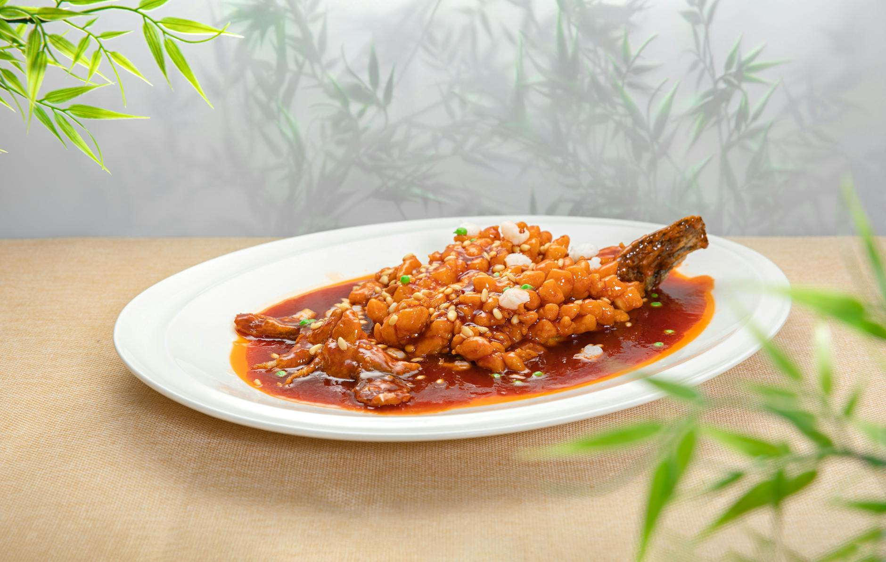

# Fish in Hot and Sour Sauce

## Overview
The combination of hot and sour is a signature of western Chinese cuisine. This quick, simple dish is perfect for a light family meal or elegant entertaining. The interplay between chilli heat, vinegar acidity, and savoury umami creates a vibrant sauce that complements delicate fish beautifully without overwhelming it.

**Serves:** 4

## Ingredients

### Fish & Cooking
- 350 grams plaice fillets
- 70 ml groundnut oil

### Hot and Sour Sauce
- 70 ml Chinese chicken stock
- 1 tablespoon dry sherry or rice wine
- 1 tablespoon dark soy sauce
- 2 teaspoons tomato purée
- ½ teaspoon chilli bean sauce or chilli powder
- ½ teaspoon white pepper
- 1 tablespoon cider vinegar or black rice vinegar
- 1 teaspoon sugar

### Garnish
- 1 tablespoon spring onions (finely chopped)

## Method

### Stage 1 – Prepare Fish
1. Using a sharp knife, remove the dark skin from the plaice.
1. Cut the fillets across the width at a slight diagonal into 2 cm wide strips.

### Stage 2 – Shallow-Fry
1. Heat a wok or large frying pan until quite hot.
1. Add the oil and heat until almost smoking.
1. Fry the fish strips in several batches for 2-3 minutes until golden brown.
1. Set aside to drain on kitchen paper.

### Stage 3 – Make Sauce
1. Pour off all the oil and wipe the wok clean.
1. Reheat the wok and add all the hot and sour sauce ingredients.
1. Bring the sauce to the boil, then immediately reduce heat to low so it simmers gently.

### Stage 4 – Combine & Serve
1. Add the fried fish strips and simmer for 2 minutes.
1. Serve immediately, garnished with spring onions.

## Notes
- **Hot and sour balance:** Neither should dominate, taste and adjust the chilli and vinegar to your preference for perfect balance.
- **Chilli bean sauce:** Use authentic fermented sauce for deep, complex heat. Chilli powder is a reasonable substitute.
- **Fish varieties:** Plaice works beautifully; cod, halibut, or any firm white fish works equally well.
- **Gentle handling:** Fish flakes easily, be gentle when simmering to maintain presentation.

## Serving
Serve with: Stir-fried spinach with garlic, or steamed rice

## Storage
- Best served immediately for optimal texture
- Keeps 1 day refrigerated (texture will soften)
- Not recommended for freezing (fish becomes mushy upon thawing)
