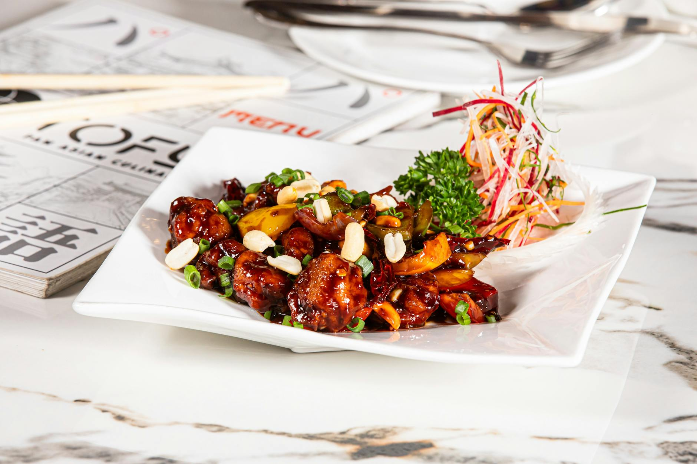

# Sichuan Chicken with Kung Pao Sauce

## Overview
This recipe from the Sichuan region of western China showcases the region's trademark use of chillies combined with the modern addition of cashew nuts. The sauce is complex and layered, savoury from fermented beans and hoisin, spicy from dried chillies, and balanced with vinegar's acidity and sugar's sweetness. The result is distinctly Chinese in technique yet contemporary in execution.

**Serves:** 4

## Ingredients

### Chicken & Coating
- 2 skinless chicken breasts (cut into neat pieces)
- 1 egg white
- 2 teaspoon cornflour
- ½ teaspoon salt

### Cooking
- 3 tablespoons sunflower oil
- 3 dried red chillies (chopped)

### Sauce
- 2 tablespoon yellow salted beans (mashed)
- 1 tablespoon hoisin sauce
- 1 teaspoon soft light brown sugar
- 1 tablespoon medium-dry sherry
- 1 tablespoon wine vinegar
- 4 garlic cloves (crushed)
- 150 ml chicken stock
- 115 grams roasted cashew nuts

### Garnish
- Fresh coriander

## Method

### Stage 1 – Coat & Prepare Sauce
1. Cut the chicken into neat pieces.
1. Lightly whisk the egg white in a dish and whisk in the cornflour and salt.
1. Add the chicken and stir until coated.
2. In a bowl, mash the beans and stir in the hoisin sauce, brown sugar, sherry, vinegar, garlic and stock. Set aside.

### Stage 2 – Cook Chicken
1. Heat a wok and add the oil.
1. Stir-fry the chicken for 2 minutes until tender.
1. Lift out the chicken and set aside.

### Stage 3 – Build Sauce
1. Heat the oil remaining in the wok and fry the chilli pieces for 1 minute.
1. Return the chicken to the wok and pour in the prepared bean sauce mixture.
1. Bring to the boil and stir in the cashew nuts.
1. Heat through.

### Stage 4 – Serve
1. Spoon into a heated serving dish.
1. Garnish with fresh coriander leaves.
1. Serve immediately.

## Notes
- **Kung pao sauce components:** The combination of mashed beans, hoisin, vinegar, and sugar creates the signature Sichuan flavour profile, not a single dominant note but a complex interplay.
- **Yellow salted beans:** Also called yellow bean sauce. Essential for authentic flavour; mash well to distribute evenly.
- **Dried chillies:** Infuse the oil with fragrance and heat without overwhelming tenderness of the chicken.

## Serving
Serve with: Steamed white rice to balance the complex sauce

## Storage
- Keeps 2-3 days refrigerated
- Freezes well up to 2-3 months
- Flavour develops after 24 hours