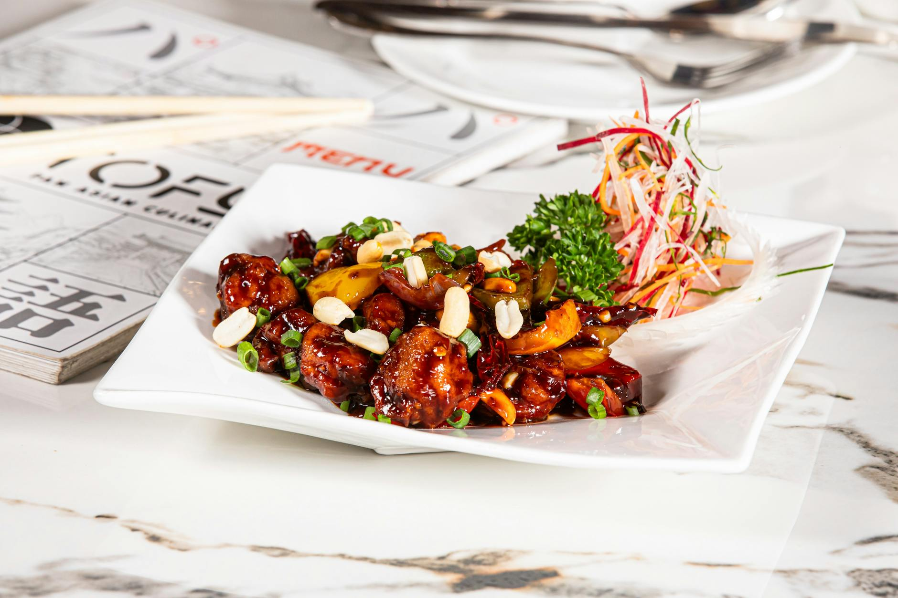

# Kung Pao Chicken

## Overview
This iconic hot and spicy chicken from western China showcases contrasting flavours, heat from chillies and Sichuan peppercorns balanced with subtle sweetness. The numbing quality of Sichuan peppercorns and the fragrance of slow-braising creates an aromatic dish that is equally delicious served immediately or reheated the next day.

**Serves:** 4

## Ingredients

### Chicken & Preparation
- 350 grams chicken pieces (with skin)
- ½ teaspoon salt
- 2 spring onions

### Cooking
- 150 ml groundnut oil
- 1 teaspoon oil (for final braising)
- 1 dried red chilli (halved length-ways)
- ½ teaspoon fresh ginger (finely chopped)
- ½ teaspoon chilli powder

### Braising Sauce
- 300 ml Chinese chicken stock
- ½ teaspoon Sichuan peppercorns (roasted and ground)
- ½ teaspoon sugar
- 2 teaspoons dark soy sauce

## Method

### Stage 1 – Prepare
1. Rub the chicken pieces with salt and let them sit for about 30 minutes.
1. Cut the spring onions into 5 cm pieces.

### Stage 2 – Infuse Oil & Brown Chicken
1. Heat the oil in a wok or large frying pan and add the dried chilli to flavour the oil.
1. When the chilli turns black, turn the heat down (you can remove the chilli or leave it in as the Chinese do).
1. Slowly brown the chicken pieces, a few at a time, skin side down.
1. Turn the chicken over and brown the other side.
1. Drain the chicken pieces on kitchen paper and set aside.

### Stage 3 – Braise
1. Clean the wok and re-heat it.
1. Add 1 teaspoon of oil to the wok and add the spring onions, ginger and chilli powder.
1. Add the chicken stock, Sichuan peppercorns, sugar and soy sauce.
1. Turn the heat down to low and add the chicken pieces.
1. Cover and finish cooking the chicken in the sauce, stirring occasionally for 20-30 minutes.

### Stage 4 – Finish
1. Serve the chicken with the sauce, removing any surface fat.

## Notes
- **Sichuan peppercorns:** Create a distinctive numbing sensation. Roast and grind just before use for maximum fragrance.
- **Dried chilli infusion:** Darkening the chilli flavours the oil gradually rather than aggressively. Choose your preferred heat level.
- **Make-ahead friendly:** This dish actually improves after 24 hours as flavours develop. Reheat gently to avoid drying the chicken.

## Serving
Serve with: Steamed white rice to balance the heat

## Storage
- Keeps 3-4 days refrigerated (flavour improves with age)
- Freezes well up to 2 months
- Remove surface fat before storing to maintain best quality