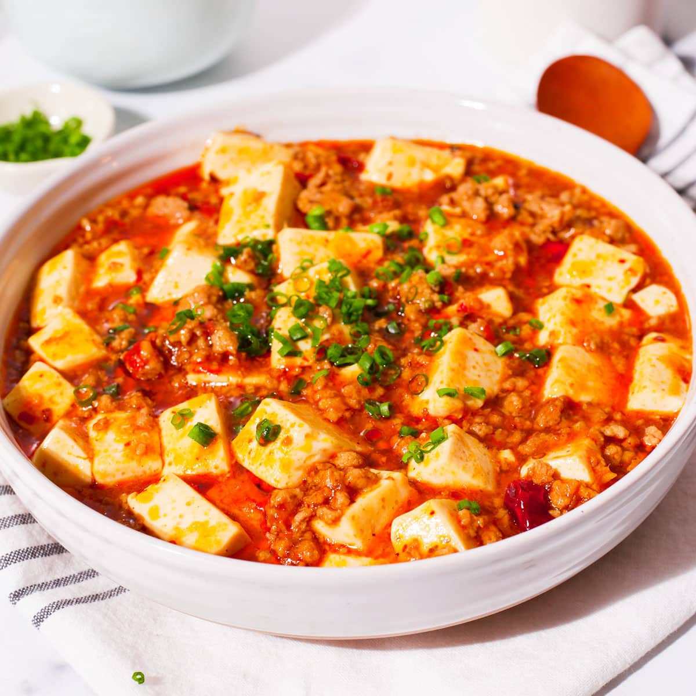

# Mapo Tofu (Vegetarian)

*Sichuan's signature tofu dish in a vegetarian build — silky tofu cubes braised in a numbing-hot sauce of doubanjiang (fermented broad-bean chilli paste), Sichuan peppercorns and finely-chopped mushrooms standing in for the usual minced pork. The numbness (málà) and the heat are the dish; tofu is the carrier.*

**Serves:** 3-4

**Prep Time:** 15 minutes

**Cook Time:** 15 minutes

## Overview
Silken tofu poaches briefly in salted water (firms it up so it doesn't break). Dried shiitake mushrooms rehydrate and chop fine. Doubanjiang fries in oil until the oil reddens; mushrooms, garlic, ginger and chilli flakes follow. Stock loosens; tofu joins gently; cornflour slurry thickens. Sichuan peppercorn dust at the table.

## Ingredients

- 600 g silken tofu (cut into 2 cm cubes)
- 1 teaspoon salt (for the poach water)

### Mushroom mince
- 30 g dried shiitake mushrooms (rehydrated 20 min in 300 ml hot water)
- 3 tablespoons vegetable oil

### Sauce base
- 3 tablespoons doubanjiang (Pixian fermented chilli broad-bean paste)
- 1 tablespoon fermented black beans (douchi; rinsed and chopped)
- 1 teaspoon Sichuan chilli flakes
- 4 garlic cloves (crushed)
- 2 cm fresh ginger (grated)

### Liquid and finish
- 300 ml mushroom-soaking liquid (strained) + 150 ml vegetable stock
- 1 tablespoon light soy sauce
- 1 teaspoon dark soy sauce (for colour)
- 1 teaspoon sugar
- 2 tablespoons cornflour mixed with 4 tablespoons cold water
- 1 tablespoon Sichuan peppercorns (toasted and ground)
- 4 spring onions (sliced)
- 2 teaspoons toasted sesame oil
- Cooked white rice (to serve)

## Method

### Stage 1 – Tofu
1. Bring a wide pan of water to a simmer with the salt.
1. Slide in the tofu cubes; poach 3 minutes; turn off the heat. The tofu will firm slightly and stay intact.

### Stage 2 – Mushrooms
1. Drain the rehydrated mushrooms (save the liquid). Squeeze dry; chop finely.
1. Heat the oil in a wok over medium heat.
1. Add the chopped mushrooms; cook 5 minutes until darkened and slightly chewy — they're standing in for the meat texture.

### Stage 3 – Sauce
1. Add the doubanjiang to the mushrooms; cook 1 minute, stirring — the oil should turn red.
1. Stir in the black beans, chilli flakes, garlic and ginger; cook 30 seconds.

### Stage 4 – Liquid
1. Pour in the strained mushroom liquid and stock.
1. Add the soy sauces and sugar.
1. Bring to a steady simmer.

### Stage 5 – Tofu and thicken
1. Lift the tofu out of its poach water with a slotted spoon; slide gently into the wok. Don't stir hard — push the tofu around with the back of a spoon.
1. Simmer 4-5 minutes; the tofu will absorb flavour.
1. Stir the cornflour slurry; pour in while gently swirling. The sauce thickens to a glossy gravy in seconds.

### Stage 6 – Finish
1. Off the heat, drizzle the sesame oil; scatter the spring onions.
1. Spoon onto a plate; dust generously with the ground Sichuan peppercorns at the table.
1. Serve with hot white rice.

## Notes
- **Doubanjiang is non-negotiable:** Pixian-style (Sichuan) fermented chilli broad-bean paste; available at Asian grocers. Korean gochujang or other chilli pastes will not give the right flavour.
- **Sichuan peppercorns:** Toast in a dry pan 1 minute; grind. Adds the numbing tingle (málà) that defines the dish.
- **Silken vs firm tofu:** Silken gives the proper soft-set texture; firm makes it more like a stir-fry. Silken handled gently doesn't break.

## Storage
- Keeps 3 days refrigerated; sauce thickens further. Reheat gently with a splash of water.
- Doesn't freeze well; the silken tofu turns spongy.
