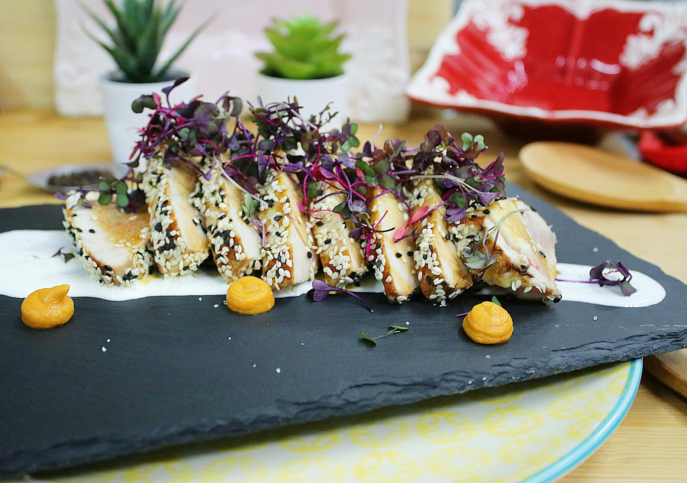

# Chicken with Sesame Seeds

## Overview
This is a version of the fragrant Sichuan dish popularly known as 'Strange taste chicken' or bang-bang chicken because it incorporates many flavours simultaneously, hot, spicy, sour, sweet, and salty all in perfect balance. The sesame seeds add a crunchy texture that contrasts beautifully with tender chicken meat. Equally delicious served hot or at room temperature, making it ideal for entertaining.

**Serves:** 4

## Ingredients

### Chicken & Coating
- 225 grams boneless chicken breasts (skinned)
- 1 egg white
- ½ teaspoon salt
- 2 teaspoons cornflour
- 150 ml groundnut oil

### Sauce
- 1 teaspoon dark soy sauce
- 1 teaspoon cider or black rice vinegar
- ½ teaspoon chilli bean sauce
- ½ teaspoon sesame oil
- 1 teaspoon sugar
- 2 teaspoons dry sherry or rice wine
- ½ teaspoon Sichuan peppercorns (roasted and ground)
- 2 teaspoons spring onions (chopped)

### Topping
- 1 tablespoon white sesame seeds

## Method

### Stage 1 – Prepare
1. Cut the chicken breasts into fine shreds of about 6 cm long, or into chunks.
1. Combine the chicken with the egg white, salt and cornflour in a small bowl.
1. Refrigerate for about 20 minutes.

### Stage 2 – Shallow-Fry
1. Heat the oil in a wok or large frying pan until moderately hot.
1. Add the chicken mixture and stir-fry quickly to keep it from sticking.
1. Cook until the chicken turns white (about 1 minute for shreds, 3-4 minutes for chunks).
1. Drain the chicken in a colander, reserving 1 tablespoon of the oil.

### Stage 3 – Toast Sesame & Build Sauce
1. Clean the wok and add the reserved oil.
1. Re-heat the wok until hot and add the sesame seeds.
1. Stir-fry the sesame seeds for 1 minute, or until slightly brown.
1. Add all the sauce ingredients and bring to the boil.

### Stage 4 – Combine & Serve
1. Return the cooked chicken to the pan.
1. Stir-fry the mixture for another 2 minutes, coating the pieces thoroughly with the sauce and sesame seeds.
1. Serve at once or leave to cool and serve at room temperature.

## Notes
- **Bang-bang chicken flavours:** The name comes from the many contradictory flavours that somehow harmonize perfectly. No single element should dominate.
- **Sesame seed toasting:** Essential step that develops nuttiness and fragrance. Watch carefully to avoid burning.
- **Temperature versatility:** The dish transforms when served cold, flavours meld and intensify. Prepare ahead for entertaining.
- **Sichuan peppercorn:** Essential for the numbing, complex finish. Roast and grind fresh for maximum impact.

## Serving
Serve with: Steamed rice if serving hot; or as a standalone dish at room temperature with crusty bread

## Storage
- Best served immediately or at room temperature within a few hours
- Keeps 2-3 days refrigerated (flavour mellows and deepens)
- Not recommended for freezing (coating texture deteriorates)
