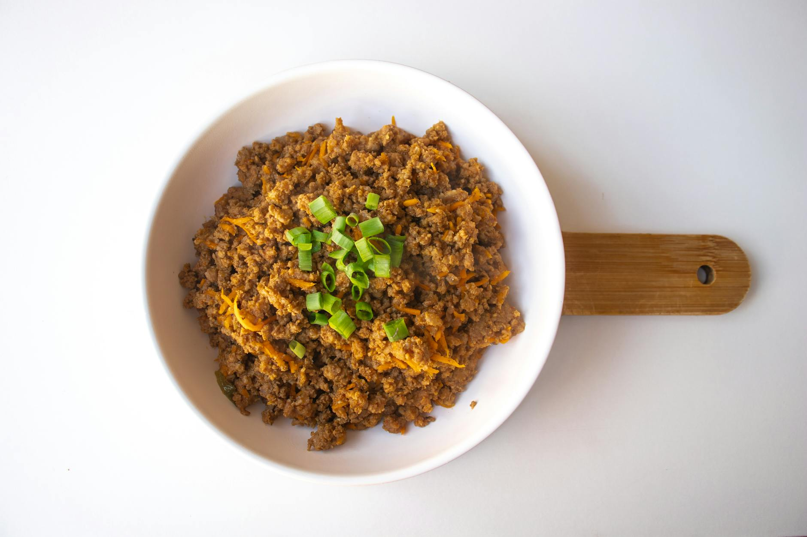

# Shredded Beef with Chillies

## Overview
The essence of this recipe lies in knife technique: the beef must be cut into very thin strips for authentic texture and rapid cooking. A brief freeze makes slicing easier and more uniform. The result is a dish of tender, fragrant beef balanced with fresh ginger, crisp vegetables, and bold chilli heat.

**Serves:** 2

## Ingredients

### Beef & Marinade
- 225 grams tenderloin beef (very thinly sliced, then cut into long shreds)
- 1 tablespoon light soy sauce
- 1 tablespoon dark soy sauce
- 1 tablespoon medium-dry sherry
- 1 teaspoon dark brown soft sugar

### Vegetables & Cooking
- 6 tablespoons vegetable oil
- 1 large onion (thinly sliced)
- 3 cm piece fresh root ginger (shredded)
- 1 carrot (very fine julienne)
- 3 fresh chillies (finely chopped)
- Salt and freshly ground black pepper

### Garnish
- Fresh chives

## Method

### Stage 1 – Prepare & Marinate
1. With a sharp knife, slice the beef as thinly as possible.
1. Cut each slice into long shreds. (If beef begins to thaw, return to freezer for 15 minutes.)
1. In a bowl, mix the light and dark soy sauces and add the sherry and sugar.
1. Add the beef strips and stir well to ensure even coating.
1. Cover and marinate in the refrigerator for 30 minutes.

### Stage 2 – Cook Vegetables
1. Heat a wok and add half the oil.
1. When hot, stir-fry the onion and ginger for 3-4 minutes, then lift out and set aside.
1. Add the carrot and stir-fry for 3-4 minutes until slightly softened. Transfer to a plate and keep warm.

### Stage 3 – Cook Beef
1. Heat the remaining oil in the wok and quickly add the beef with its marinade, followed by the chillies.
1. Cook over high heat for 2 minutes, stirring constantly.
1. Return the fried onion and ginger to the wok and stir-fry for 1 minute more.
1. Season with salt and pepper to taste, cover and cook for 30 seconds.

### Stage 4 – Serve
1. Spoon the meat into 2 warmed bowls with the carrot strips.
1. Garnish with fresh chives and serve immediately.

## Notes
- **Freezing technique:** Freezing beef for 30 minutes before slicing allows uniform, paper-thin shreds that cook instantly.
- **High-heat stir-frying:** Essential to preserve beef's texture and prevent toughening. Keep moving constantly.
- **Vegetable separation:** Cooking vegetables separately then recombining maintains texture contrast.

## Serving
Serve with: Steamed rice or noodles

## Storage
- Best served immediately for optimal texture
- Keeps 1-2 days refrigerated (beef may toughen; vegetables soften)
- Not recommended for freezing