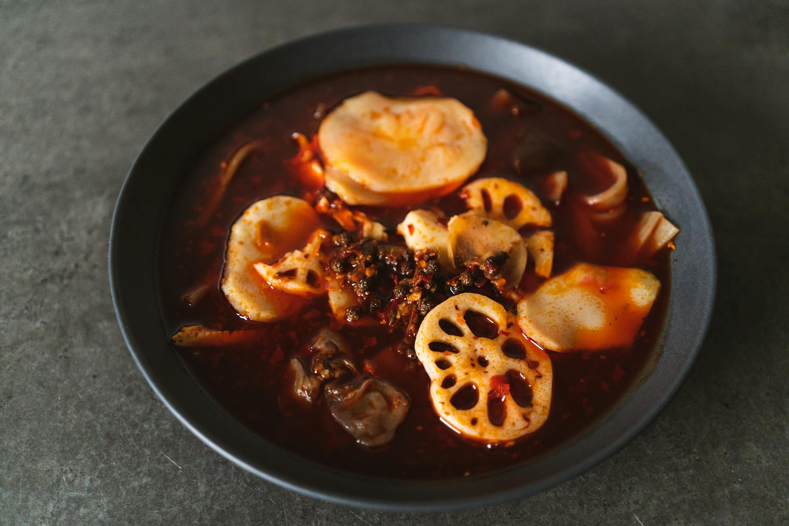

# Sichuan Chicken

## Overview
This straightforward Sichuan preparation showcases the region's bold use of chillies and spices. The technique is simple: season, rest, and cook in layers, building flavour as you go. Oyster sauce adds depth, while seven spices (chilli power, Sichuan pepper, salt, garlic, ginger, pepper) create a full-bodied dish.

**Serves:** 4

## Ingredients

### Chicken & Seasonings
- 250 grams chicken fillets
- 2 cloves garlic (grated)
- 2 cm ginger
- ½ tsp salt
- ½ tsp red chilli powder

### Cooking & Sauce
- 1 tbsp oil
- 3 cloves garlic (roughly chopped)
- ½ red or green bell pepper
- 5 dried chillies
- 2 tbsp oyster sauce
- 4 tsp soy sauce
- ¼ tsp black pepper
- ¼ tsp sugar
- 250 ml water

## Method

### Stage 1 – Season & Rest
1. Sprinkle chicken fillets with grated garlic, ginger, salt and red chilli powder.
1. Let the chicken rest for 30 minutes.

### Stage 2 – Sauté Aromatics
1. Heat oil in a wok or large pan.
1. Sauté chopped garlic in oil until fragrant.
1. Add bell pepper and dried chillies and sauté until wilted.

### Stage 3 – Cook Chicken
1. Add chicken and stir until it begins to brown.

### Stage 4 – Build Sauce
1. Add the oyster sauce, soy sauce, black pepper and sugar.
1. Stir well.
1. Pour in the water and cook until absorbed and chicken is done.
1. Serve with boiled rice.

## Notes
- **Resting period:** The 30-minute rest allows seasonings to penetrate the chicken and tenderize it.
- **Aromatics layering:** Building flavour in stages (garlic first, then peppers and chillies) creates more complex result than adding all at once.
- **Dried chillies:** Add texture and flavour. Adjust quantity based on heat preference.

## Serving
Serve with: Steamed or boiled white rice to balance the spices

## Storage
- Keeps 2-3 days refrigerated
- Freezes well up to 2-3 months
- Flavour develops after 24 hours