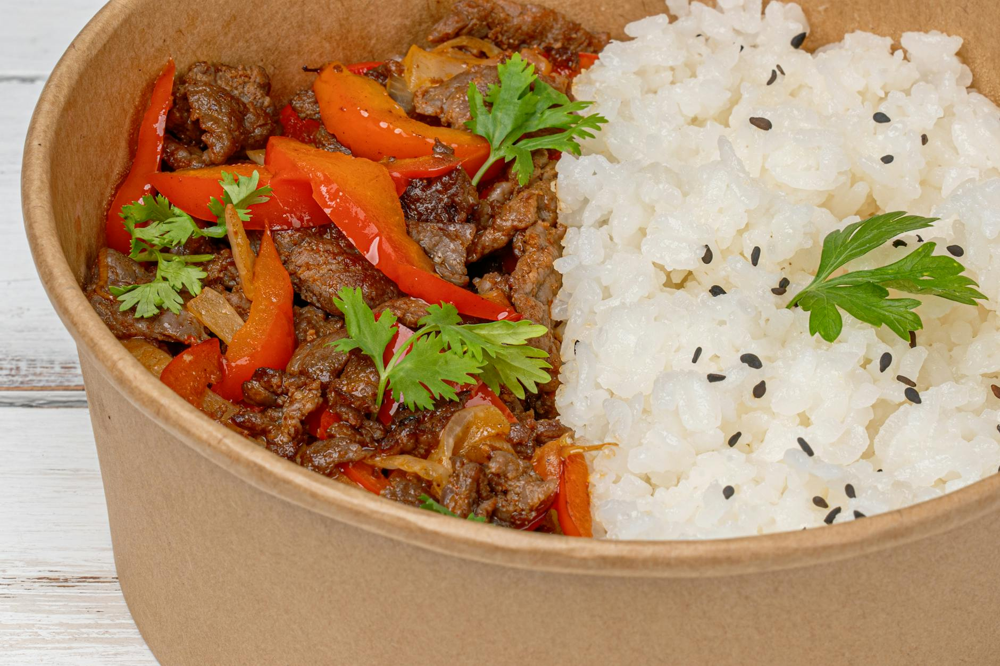

# Sichuan Pepper Beef

## Overview
This fast, easy, and delicious supper showcases how Chinese five-spice powder flavours an entire dish via a marinade approach. Overnight marination develops deep, complex flavours that distinguish this simple stir-fry from quickly-thrown-together meals. The combination of Sichuan pepper's numbing quality with five-spice complexity creates an unforgettable sauce.

**Serves:** 2

## Ingredients

### Beef & Marinade
- 2 Sirloin steaks (cut into strips)
- 1 tablespoon Shaoshing rice wine
- 2 teaspoons ground Sichuan pepper
- 1 teaspoon dark soy sauce
- ½ teaspoon Chinese five-spice powder
- 2 garlic cloves (finely chopped)

### Cooking
- 2 tablespoon groundnut oil

### Vegetables & Sauce
- 1 medium red chilli (deseeded and chopped)
- ½ onion (chopped)
- 1 small handful broccoli
- 1 small handful chopped mangetout
- 1 small handful chopped carrots
- 1 small handful chopped babycorn
- 300 ml hot fresh beef stock
- 1 tablespoon light soy sauce
- 1 tablespoon cornflour (blended with 2 tablespoon cold water)
- 1 spring onion (finely sliced)
- Salt and ground white pepper

## Method

### Stage 1 – Marinate
1. Mix all the marinade ingredients in a bowl.
1. Add the beef and marinate for as long as possible (overnight is best).

### Stage 2 – Stir-Fry Beef
1. Heat a wok over high heat and add the oil.
1. Stir-fry the marinated beef for 2 minutes.

### Stage 3 – Add Vegetables
1. Add the red chilli and onion and stir-fry for less than 1 minute.
1. Add the remaining vegetables and stir-fry for 1 minute.

### Stage 4 – Build Sauce
1. Add the hot stock and mix well.
1. Season with light soy sauce.
1. Bring to the boil.
1. Add the blended cornflour and stir well.
1. Add the spring onion, season to taste and serve with Jasmine rice.

## Notes
- **Overnight marination:** Essential for deep flavour development. The longer the better.
- **Five-spice powder:** The key to this recipe, it flavours the entire sauce through the marinade.
- **Sichuan pepper:** Provides the signature numbing sensation that distinguishes Sichuan cooking.

## Serving
Serve with: Jasmine rice

## Storage
- Keeps 2-3 days refrigerated
- Freezes well up to 2-3 months
- Flavour improves after 24 hours