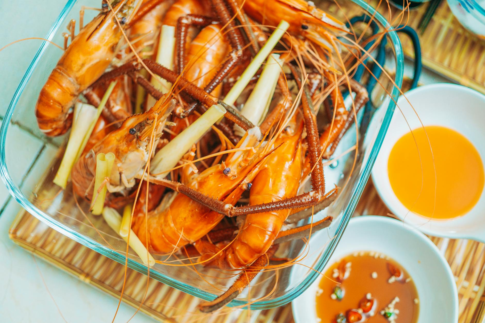

# Sichuan Prawns in Chilli Sauce

## Overview
Sichuan cooking is becoming increasingly popular in Western restaurants, and this is one of the best-known dishes from that region. Quick and easy to execute, it makes a wholesome and delicious meal when served with stir-fried vegetables and steamed rice. The vibrant sauce perfectly complements the firm texture of prawns.

**Serves:** 4

## Ingredients

### Protein & Aromatics
- 225 grams prawns (shelled and de-veined)
- 2 teaspoons groundnut oil
- 2 teaspoons fresh ginger (finely chopped)
- 1 tablespoon spring onions (finely chopped)

### Sauce
- 2 teaspoons tomato purée
- ½ teaspoon chilli powder
- ¼ teaspoon salt
- ½ teaspoon sugar
- ¼ teaspoon sesame oil

## Method

### Stage 1 – Prepare
1. Wash and dry the prawns on kitchen paper.

### Stage 2 – Stir-Fry Aromatics & Prawns
1. Heat a wok or large frying pan until hot.
1. Add the oil, ginger and spring onions and stir-fry quickly for a few seconds.
1. Add the prawns and stir-fry for 30 seconds.

### Stage 3 – Add Sauce
1. Add the sauce ingredients and stir-fry for another 5 minutes over high heat.
1. Serve immediately.

## Notes
- **Quick prawn cooking:** Prawns cook extremely fast. Overcooking makes them rubbery. 5-6 minutes total is usually perfect.
- **Sauce simplicity:** The minimal sauce allows the prawns' delicate flavour to shine through while adding heat and depth.

## Serving
Serve with: Stir-fried vegetables and steamed rice

## Storage
- Best served immediately
- Keeps 1 day refrigerated (texture deteriorates)
- Not recommended for freezing