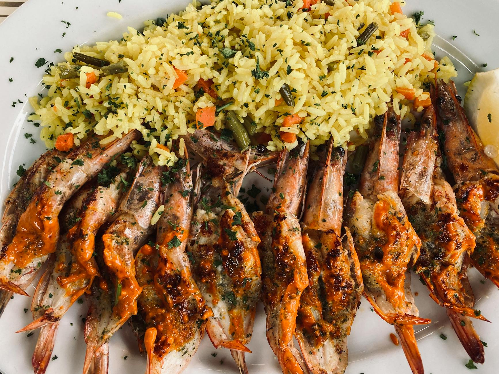

# Sizzling Rice Prawns

## Overview
This is a dramatic dish sure to earn you compliments. Moderately easy to make but requiring organisation and some Chinese cooking experience. The key to success is that both the prawn sauce mixture and rice cake must be fairly hot, this creates a dramatic, theatrical sizzle when they combine. A showstopping presentation perfect for entertaining.

**Serves:** 6-8

## Ingredients

### Prawns & Aromatics
- 450 grams prawns (shelled and de-veined)
- 2 tablespoons groundnut oil
- 2 teaspoons ginger (finely chopped)
- 1½ tablespoons spring onions (finely chopped)

### Sauce
- 110 grams red or green pepper (diced)
- 1 tablespoon cider or black rice vinegar
- 1 tablespoon dark soy sauce
- 2 dried red chillies
- 1½ tablespoons tomato purée
- 1 teaspoon light soy sauce
- 1½ tablespoons dry sherry or rice wine
- 1 teaspoon sugar
- 300 ml Chinese chicken stock
- 1 tablespoon cornflour (blended with 1 tablespoon water)

### Rice Cake & Deep-Frying
- 1 rice cake (broken into pieces)
- 1 litre groundnut oil (for deep frying)

## Method

### Stage 1 – Prepare Prawns
1. Wash and pat dry the prawns on kitchen paper.
1. Using a sharp knife, split the prawns in half but leave them attached at the back so they splay out like butterflies.

### Stage 2 – Stir-Fry Prawns
1. Heat a wok or large frying pan until quite hot.
1. Add the 2 tablespoons of oil and let it heat for a few seconds until almost smoking.
1. Add the ginger and stir quickly for a few seconds.
1. Add the spring onions followed by the butterflied prawns.
1. Stir-fry quickly until they become firm (about 30 seconds).

### Stage 3 – Build Sauce
1. Add all the sauce ingredients except the cornflour mixture.
1. Bring to the boil, then reduce heat to a very slow simmer.

### Stage 4 – Prepare Rice Cake
1. Heat the oil in a deep fat fryer or large wok until nearly smoking.
1. Drop in a small piece of rice to test the heat; it should bubble all over and immediately come to the surface.
1. Deep-fry the pieces of rice cake for 1-2 minutes until they puff up and brown slightly.
1. Remove immediately with a slotted spoon and drain on kitchen paper.
1. Quickly transfer to a platter.

### Stage 5 – Finish & Sizzle  
1. Just before serving, thicken the prawn sauce with the cornflour mixture.
1. Pour the hot prawn and sauce mixture over the rice cakes.
1. The rice should sizzle dramatically. (Can be performed at table for effect.)
1. Serve immediately.

## Notes
- **Temperature critical:** Both the prawn mixture and rice must be as hot as possible for the dramatic sizzle effect.
- **Rice cake selection:** Use authentic Chinese rice cakes which are sold dried in Asian markets.
- **Prawn butterflying:** Keeping the tail intact creates an elegant presentation and helps them hold their shape.
- **Timing:** Deep-fry the rice just before serving; it softens quickly as it absorbs the sauce.

## Serving
Serve at table for dramatic effect

## Storage
- Best served immediately for optimal sizzle and texture
- Not recommended for storage or freezing