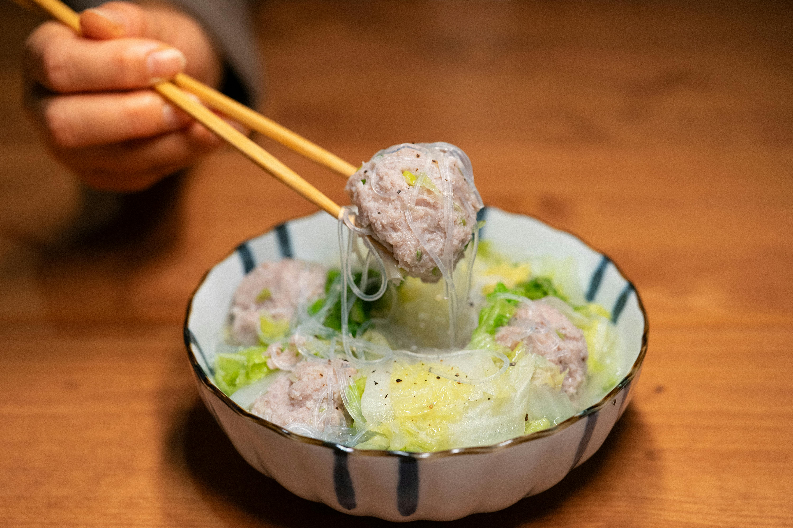

# Steamed Beef Meatballs

## Overview
The secret to light and fluffy meatballs lies in proper technique: egg white and cornflour incorporate air into the mixture, creating a delicate texture. This gentle steaming method keeps them moist and tender while the aromatics infuse throughout. These meatballs reheat beautifully by steaming and are perfect for dinners or as an appetizer at parties.

**Serves:** 4

## Ingredients

### Base
- 350 grams minced beef
- 1 egg white
- 1 tablespoon very cold water

### Seasonings & Aromatics
- ½ teaspoon salt
- 1 tablespoon light soy sauce
- 1 teaspoon freshly ground black pepper
- 2 teaspoons sesame oil
- 1 tablespoon fresh coriander (finely chopped)
- 1½ tablespoons spring onions (finely chopped)
- 1 teaspoon cornflour
- 1 teaspoon sugar

## Method

### Stage 1 – Mix Meat Base
1. Process the beef in a blender for a few seconds.
1. Add the egg white and cold water and mix for a few more seconds until fully incorporated into the meat.

### Stage 2 – Add Seasonings
1. Add the rest of the ingredients and mix for about a minute until the meat mixture becomes a light paste.

### Stage 3 – Form & Steam
1. Using your hands, form the mixture into 3 cm balls.
1. Put the meatballs on a plate and place inside a steamer.
1. Cover and steam for about 20 minutes.

### Stage 4 – Finish
1. Pour off any liquid that has accumulated on the plate.
1. Turn onto a platter and serve immediately. (Refrigerate if making ahead.)

## Notes
- **Egg white and cornflour:** Both add lift and moisture to the meatballs, preventing them from becoming dense.
- **Very cold water:** Cold liquid helps keep the mixture light. Use chilled water or ice water.
- **Steaming:** Gentler than pan-frying, steaming keeps the meatballs moist and tender.

## Serving
Serve with: A dipping sauce such as soy-ginger or chilli oil; or as part of a larger Chinese meal

## Storage
- Keeps 3-4 days refrigerated
- Freezes well up to 2-3 months
- Reheat by steaming for 5-10 minutes