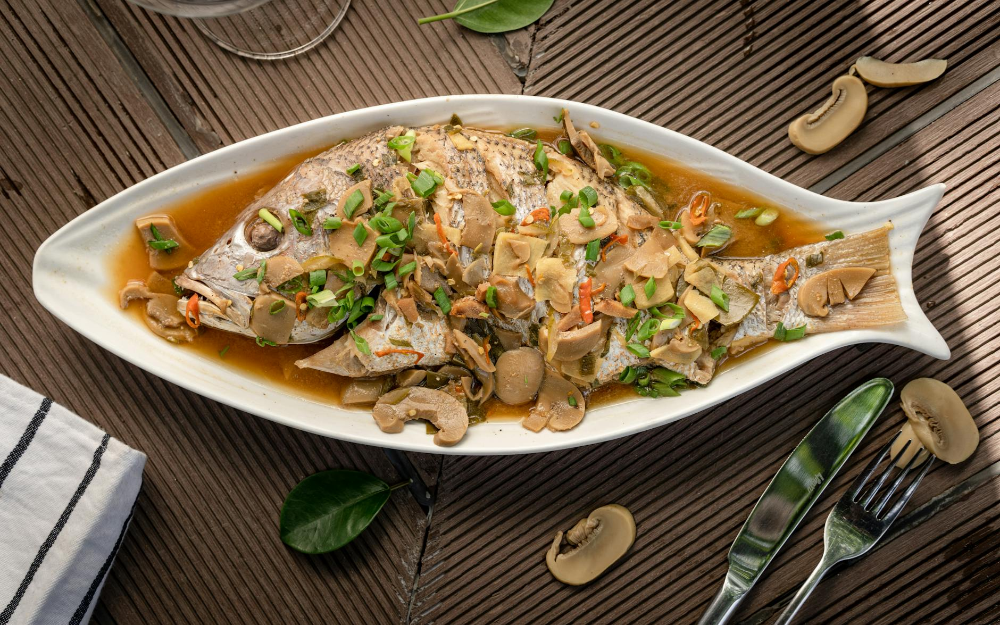

# Steamed Fish

## Overview
Steaming is a great southern Chinese tradition and is considered the preferred method of cooking fish as it brings out the purest flavours. Because it is such a gentle cooking technique, nothing masks the fresh taste of the fish, which remains moist and tender. Simple aromatics, ginger, garlic, and spring onion, infuse the fish without overwhelming its delicate character.

**Serves:** 4

## Ingredients

### Fish & Seasoning
- 350 grams firm white fish fillets
- 1 teaspoon coarse sea salt
- 1 tablespoon fresh ginger (finely chopped)

### Garnish & Sauce
- 2 tablespoons spring onions (finely chopped)
- 1 tablespoon light soy sauce
- 1 tablespoon groundnut oil
- 1 teaspoon sesame oil
- 2 garlic cloves (thinly sliced)

## Method

### Stage 1 – Prepare Fish
1. If using whole fish, remove the gills and de-scale the entire fish.
1. Pat the fish dry with kitchen paper and rub salt on both sides.
1. Set aside for 3 minutes (this helps the flesh to firm up and draws out excess moisture).

### Stage 2 – Set Up Steamer
1. Set up a steamer or put a wire rack into a wok or deep pan.
1. Fill the pan with 5 cm of water.
1. Bring to the boil, then reduce heat to a low simmer.

### Stage 3 – Steam Fish
1. Put the fish on a plate and scatter the ginger evenly over the top.
1. Put the plate of fish into the steamer or onto the rack.
1. Cover the pan tightly and gently steam the fish until just cooked.
1. Flat fish will take about 5 minutes; thicker fish such as sea bass will take about 15 minutes.

### Stage 4 – Garnish & Serve
1. Remove the plate of cooked fish and sprinkle with spring onions and light soy sauce.
1. Heat the two oils together in a small saucepan.
1. When hot, add the garlic slices and brown them.
1. Pour the garlic-oil mixture over the top of the fish and serve at once.

## Notes
- **Salt resting:** The 3-minute rest firms the flesh and releases moisture before steaming, preventing a soggy result.
- **Steaming time:** Depends on fish thickness. Fish is done when flesh is opaque and flakes easily, don't overcook.
- **Garlic oil finish:** The hot oil infused with garlic adds fragrance and richness without masking the fish's delicate flavour.

## Serving
Serve with: Steamed white rice and a simple vegetable like bok choi

## Storage
- Best served immediately
- Keeps 1 day refrigerated (texture somewhat compromised)
- Not recommended for freezing (fish becomes mushy upon thawing)