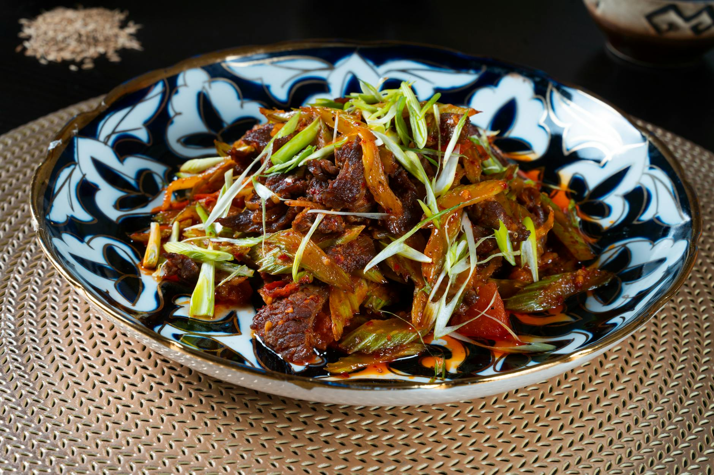

# Stir-Fried Beef with Ginger

## Overview
This typically Cantonese dish is one of the quickest and tastiest ways to cook beef. The ginger adds a subtle and fragrant spiciness that enhances without overwhelming the tender beef. Freezing the beef before slicing is essential for uniform, thin strips that cook instantly.

**Serves:** 4

## Ingredients

### Beef (Frozen) & Marinade
- 350 grams lean beef steak (frozen)
- ¼ teaspoon salt
- 2 teaspoons light soy sauce
- 2 teaspoons dry sherry
- ½ teaspoon sesame oil
- 1 teaspoon cornflour

### Aromatics & Sauce
- 1 slice fresh ginger (finely shredded)
- 1 tablespoon oil
- 1 tablespoon Chinese chicken stock
- ½ teaspoon sugar

## Method

### Stage 1 – Slice & Marinate
1. Using a very sharp knife, slice the frozen beef into thin strips.
1. Put the beef into a bowl and add the salt, soy sauce, sherry, sesame oil and cornflour.
1. Mix well and let the slices steep in the marinade for about 15 minutes.
1. Meanwhile, finely shred the ginger slice and set aside.

### Stage 2 – Stir-Fry Beef
1. Heat a wok or large frying pan and add the oil.
1. When very hot and nearly smoking, remove the beef from the marinade using a slotted spoon and stir-fry for about 2 minutes.
1. When all the beef is cooked, remove it and wipe the wok clean.

### Stage 3 – Build Sauce
1. Re-heat the wok.
1. Add a little oil and stir-fry the ginger for a few seconds.
1. Add the stock and sugar.

### Stage 4 – Combine & Serve
1. Quickly return the meat to the pan and stir well.
1. Turn onto a platter and serve at once.

## Notes
- **Frozen beef slicing:** Freezing beef makes it easier to slice thinly and uniformly. Don't let it thaw completely before slicing.
- **High-heat stir-frying:** Essential to seal the meat and keep it tender. Don't overcrowd the wok.
- **Ginger fragrance:** Fresh ginger added late to the cooking preserves its delicate aroma without becoming acrid.

## Serving
Serve with: Steamed rice or serve on lettuce with oyster sauce (traditional variation)

## Storage
- Best served immediately for optimal texture
- Keeps 1-2 days refrigerated (beef may toughen)
- Not recommended for freezing