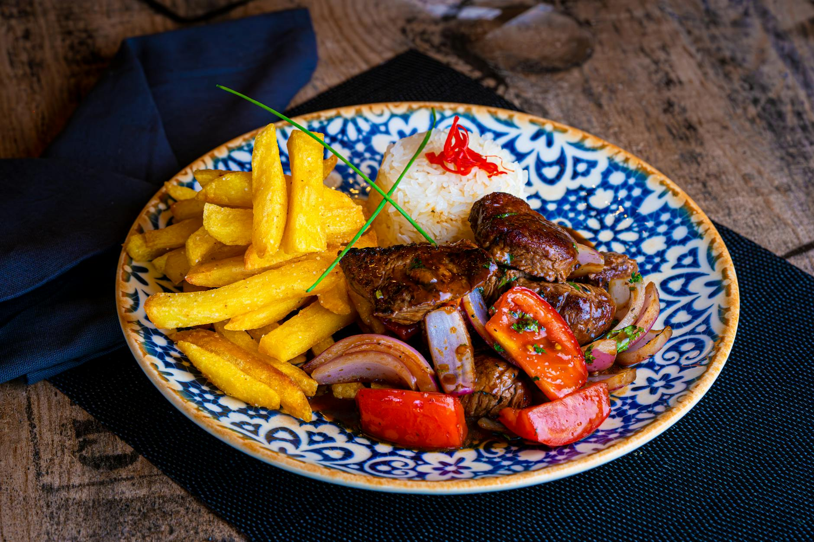

# Stir-Fried Beef with Orange

## Overview
This is a northern Chinese beef speciality that lends itself to using dried tangerine peel. The Chinese always use peel that has been dried, and the older the peel, the more prized the flavour. The combination creates a sophisticated, citrus-forward sauce that balances the richness of beef beautifully.

**Serves:** 4

## Ingredients

### Beef & Marinade
- 350 grams lean beef steak (cut against the grain into thin slices, about 5 cm long)
- 2 teaspoon dark soy sauce
- 2 teaspoons dry sherry
- 1 teaspoon fresh ginger (finely chopped)
- 1 teaspoon cornflour
- 1 teaspoon sesame oil

### Cooking
- 70 ml groundnut oil

### Sauce
- 2 dried red chillies
- 1 tablespoon dried tangerine peel (soaked and chopped)
- ½ teaspoon roasted Sichuan peppercorns (finely ground)
- 2 teaspoons dark soy sauce
- ¼ teaspoon salt
- 1 teaspoon sugar
- ½ teaspoon sesame oil

## Method

### Stage 1 – Prepare & Marinate
1. Cut the beef into thin slices, about 5 cm long, cutting against the grain.
1. Put the beef into a bowl together with the soy sauce, sherry, ginger, cornflour and 1 teaspoon sesame oil.
1. Mix well and marinate for 20 minutes.

### Stage 2 – Stir-Fry Beef
1. Heat the groundnut oil in a wok or large frying pan until very hot.
1. Remove the beef from the marinade with a slotted spoon and add to the pan.
1. Stir-fry for 2 minutes until browned.
1. Remove the beef and drain in a colander or sieve.

### Stage 3 – Build Sauce
1. Pour off most of the oil in the wok, leaving about 1 teaspoon.
1. Re-heat the pan over high heat.
1. Add the dried chillies and stir-fry for 10 seconds.
1. Return the beef to the pan.
1. Add the remaining sauce ingredients and stir-fry for 4 minutes, mixing well.
1. Serve at once.

## Notes
- **Dried tangerine peel:** Essential for authentic flavour. The older the peel, the more complex and prized. Soak before chopping.
- **Cutting against the grain:** Essential for tenderness. Slicing with the grain creates a chewy texture.
- **Sichuan peppercorn:** Adds the signature numbing sensation that defines Sichuan cooking.

## Serving
Serve with: Steamed white rice

## Storage
- Keeps 2-3 days refrigerated
- Freezes well up to 2-3 months
- Flavour develops after 24 hours