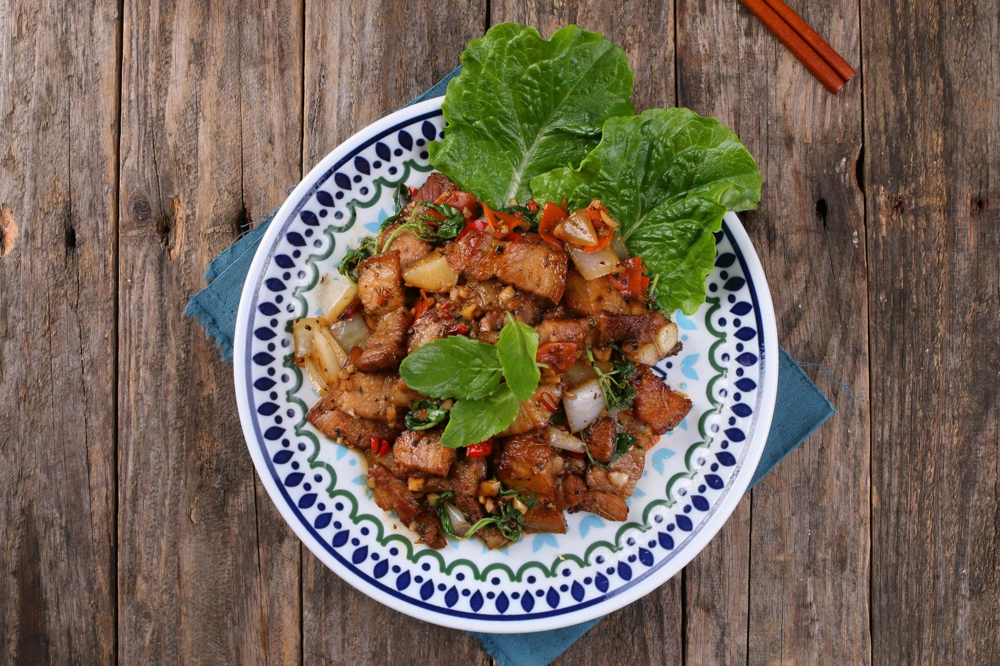

# Stir-Fried Pork with Spring Onions

## Overview
This simple stir-fried dish in the southern Chinese tradition showcases how elemental technique and timing create exceptional results. The key to success is not to overcook the pork. A brief marinade tenderizes the meat and infuses flavour, while spring onions added late retain their fresh bite and delicate onion flavour.

**Serves:** 4

## Ingredients

### Pork & Marinade
- 350 grams boneless lean pork (cut into thin slices, about 5 cm long)
- 2 teaspoons dry sherry
- 2 teaspoons light soy sauce
- ½ teaspoon cornflour

### Cooking & Finishing
- 2 teaspoons oil
- 4 spring onions (cut diagonally into 5 cm lengths)
- ½ teaspoon salt
- ½ teaspoon sugar

## Method

### Stage 1 – Prepare & Marinate
1. Cut the pork into thin slices, about 5 cm long.
1. Put the sliced pork into a bowl and mix in the dry sherry, soy sauce and cornflour.
1. Let the mixture sit for 10-15 minutes so the pork absorbs the flavours.

### Stage 2 – Prepare Spring Onions
1. Cut the spring onions on the diagonal into 5 cm lengths.

### Stage 3 – Stir-Fry
1. Heat a wok to very high heat and add the oil.
1. When almost smoking, add the pork slices and stir-fry until brown.
1. Add the spring onions, salt and sugar.
1. Continue to stir-fry until the pork is cooked and slightly firm. This should take about 5 minutes total.

### Stage 4 – Serve
1. Remove and arrange the pork on a warm serving platter.
1. Pour over any juices and serve at once.

## Notes
- **Not overcooking:** Pork can become tough if overcooked. Watch carefully, it should be cooked through but still tender.
- **Spring onion timing:** Adding spring onions late preserves their fresh flavour and delicate texture.
- **Marinade importance:** The 10-15 minute rest lets the cornflour coat the pork, aiding even cooking and tenderizing with soy and sherry.

## Serving
Serve with: Steamed white rice

## Storage
- Best served immediately
- Keeps 1-2 days refrigerated (pork toughens slightly; spring onions wilt)
- Not recommended for freezing