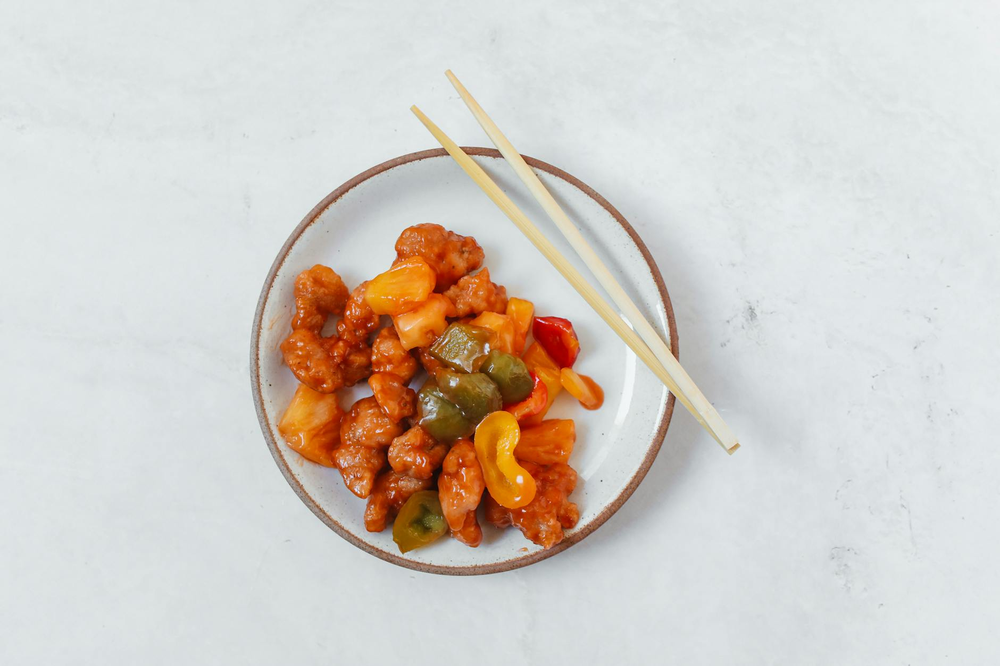

# Sweet and Sour Pork

## Overview
Often mis-made in the West as doughy balls drowned in cloying sauce, properly prepared sweet and sour pork is a delicate balance of flavours, neither strictly sweet nor sour, but harmoniously combined. The key is quality ingredients, proper deep-frying technique, and a refined sauce that complements rather than masks the tender pork. Tinned lychees add authentic sweetness and texture.

**Serves:** 4

## Ingredients

### Pork & Marinade
- 350 grams lean pork (cut into 2 cm cubes)
- 1 tablespoon dry sherry
- 1 tablespoon light soy sauce
- ½ teaspoon salt

### Batter & Frying
- 1 egg (beaten)
- 2 tablespoons cornflour
- 400 ml groundnut oil (for frying)

### Vegetables
- 50 grams green pepper (cut into 2 cm squares)
- 50 grams red pepper (cut into 2 cm squares)
- 50 grams carrots (cut into 2 cm cubes)
- 50 grams spring onions (cut into 2 cm cubes)

### Sauce
- 150 ml Chinese chicken stock
- 1 tablespoon light soy sauce
- ½ teaspoon salt
- 1½ teaspoons cider vinegar (or white rice vinegar)
- 1 tablespoon sugar
- 1 tablespoon tomato purée
- 1 teaspoon cornflour (blended with 1 teaspoon water)
- 75 grams tinned lychees

## Method

### Stage 1 – Prepare & Marinate
1. Cut the pork into 2 cm cubes.
1. Put the cubes into a bowl together with the sherry, soy sauce and salt.
1. Leave to marinate for 20 minutes.

### Stage 2 – Prepare Vegetables
1. Cut the green and red peppers into 2 cm squares.
1. Peel and cut the carrots and spring onions into 2 cm cubes.
1. Bring a pot of water to the boil and blanch the carrots for 4 minutes.
1. Remove the carrots and plunge into ice cold water, then drain and set aside.

### Stage 3 – Deep-Fry Pork
1. Mix the egg and cornflour in a bowl to a uniform batter.
1. Lift the pork cubes out of the marinade and place them in the batter to coat each piece well.
1. Heat the oil in a deep-fryer or large wok until it is almost smoking.
1. Remove the pork pieces from the batter with a slotted spoon and deep-fry them.
1. Drain the deep-fried pork cubes on kitchen paper.

### Stage 4 – Make Sauce & Combine
1. Combine the chicken stock, soy sauce, salt, vinegar, sugar and tomato purée in a large saucepan.
1. Add all the vegetables and stir well.
1. In a small bowl, blend together the cornflour and water.
1. Stir this mixture into the sauce and bring it back to the boil.
1. Turn the heat down to a simmer.
1. Add the lychees and pork cubes.
1. Mix well and turn onto a deep platter. Serve at once.

## Notes
- **Deep-frying temperature:** Oil should be almost smoking (around 180°C) to create a crisp exterior while keeping pork tender inside.
- **Batter consistency:** Should be thick enough to coat firmly but thin enough to fry quickly, avoid heavy, doughy results.
- **Balance of flavours:** The interplay of sweet (sugar, lychees), sour (vinegar), salty (soy), and umami (tomato) should be subtle. Taste and adjust the vinegar/sugar ratio to preference.
- **Lychees:** Essential to authentic flavour and texture, do not substitute with pineapple or other fruits.

## Serving
Serve with: Plain steamed rice and a simple blanched vegetable such as Bok Choi in soy sauce

## Storage
- Best served immediately for optimal crispness
- Keeps 1-2 days refrigerated (pork softens and may lose crispness)
- Not recommended for freezing (batter texture deteriorates significantly upon thawing)