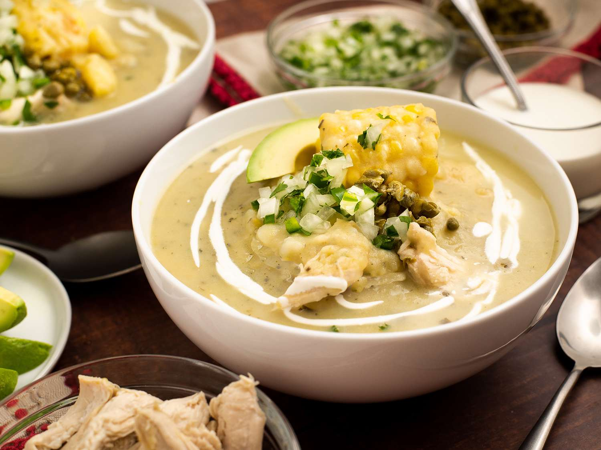

# Ajiaco

*Bogotá's signature Andean chicken soup, defined by three different potato varieties and the herb guascas. Long-cooked papa criolla almost dissolves and thickens the broth; sabanera and pastusa hold their shape for texture. Served with avocado, capers, cream and a wedge of corn on the cob in the bowl. The capital's national dish.*

**Serves:** 6

**Prep Time:** 25 minutes

**Cook Time:** 1¼ hours

## Overview
Chicken poaches with onion, garlic and herbs into a clean, golden broth. The first potato (sabanera, or floury maris piper) drops in to start; the small yellow papa criolla follows to break down and thicken; pastusa or red potatoes go in last to hold shape. Cobs of sweet corn cook in the same pot. Guascas — the dish's signature herb — adds at the very end. Each bowl tops with shredded chicken, avocado, capers and a generous spoon of cream; rice on the side.

## Ingredients

### Soup
- 1.5 kg chicken pieces (bone-in thighs and drumsticks)
- 1 large onion (quartered)
- 6 garlic cloves (smashed)
- 4 spring onions (whole, smashed)
- 1 small bunch coriander stems (tied with string)
- 2 bay leaves
- 1 teaspoon black peppercorns
- 1 teaspoon ground cumin
- 2 teaspoons salt
- 2.5 litres water

### Potatoes and corn
- 600 g sabanera or maris piper potatoes (peeled, sliced 1 cm)
- 600 g papa criolla (peeled, halved if large; or substitute baby Yukon golds)
- 600 g pastusa or red-skinned potatoes (peeled, cut into 3 cm chunks)
- 3 ears sweet corn (cut into 4 cm rounds)

### To finish
- 4 tablespoons dried guascas (the herb that defines the dish; sold at Latin grocers)
- A small bunch coriander (chopped)

### To serve
- 2 ripe avocados (sliced)
- 4 tablespoons capers (rinsed)
- 200 ml double cream or crème fraîche
- 1 lime (cut into wedges)
- Cooked white rice

## Method

### Stage 1 – Poach the chicken
1. Place the chicken in a large pot with the onion, garlic, spring onions, coriander stems, bay, peppercorns, cumin, salt and water.
1. Bring to the boil; skim the foam.
1. Reduce to a steady simmer; cook 25-30 minutes until the chicken is tender.
1. Lift the chicken onto a plate; cool slightly. Strain the broth through a fine sieve into a clean pot.

### Stage 2 – Shred the chicken
1. Pull the meat from the bones into shreds; discard skin and bones. Cover and reserve.

### Stage 3 – First potato
1. Bring the strained broth back to a simmer.
1. Add the sabanera potatoes; cook 15 minutes.

### Stage 4 – Papa criolla
1. Add the papa criolla; cook 20 minutes, mashing some of them against the side of the pot to release starch (this is what gives ajiaco its characteristic body).

### Stage 5 – Pastusa and corn
1. Add the pastusa potatoes and the corn rounds.
1. Cook 15 minutes more until everything is tender and the broth has thickened.

### Stage 6 – Finish
1. Stir in the guascas and chopped coriander.
1. Return the shredded chicken; warm through 2 minutes.
1. Taste; adjust salt.

### Stage 7 – Serve
1. Ladle into wide bowls — make sure each bowl gets a wedge of corn on the cob.
1. Top each with avocado slices.
1. Bring capers, cream, lime and rice to the table; each diner garnishes their own.

## Notes
- **Three potatoes is the dish:** Substituting just one type gives a different soup. Floury + waxy + small yellow gives the layered texture that defines ajiaco.
- **Guascas:** Sold dried at Latin/Colombian grocers. Without it, this is a chicken-potato soup, not ajiaco. No real substitute.
- **Add cream and capers at the table:** Stirring them into the pot mutes them. Each diner adjusts to taste.

## Storage
- Keeps 4 days refrigerated; the broth thickens further. Reheat gently with a splash of water.
- Freezes 3 months without the cream / capers / avocado.
