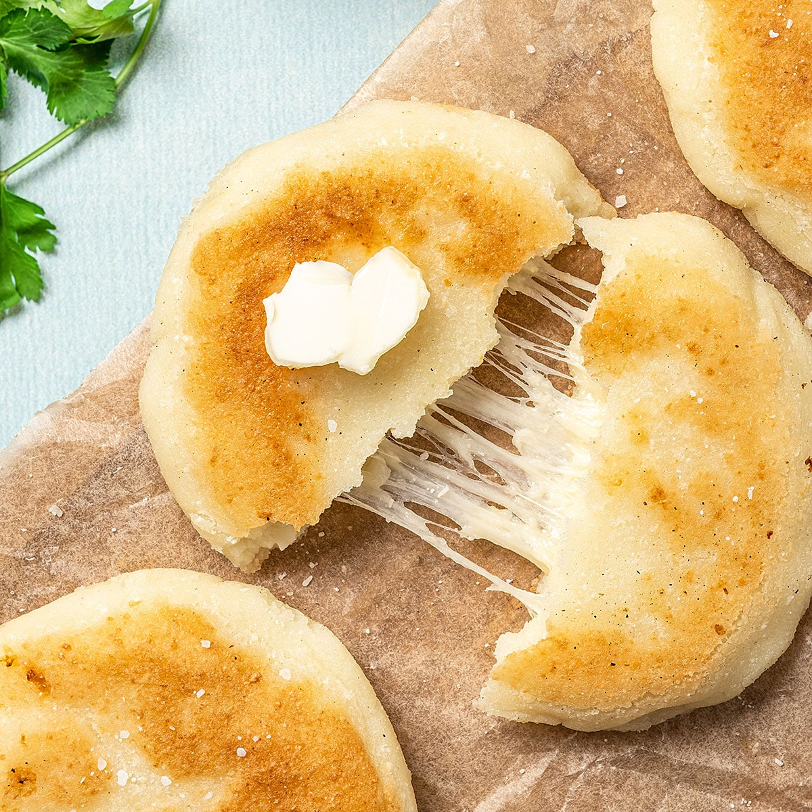

# Arepas de Queso

*Colombian cheese arepas: corn cakes built on pre-cooked white maize flour (masarepa), stuffed with cheese in the dough so it melts through as they cook. Crisp on the outside, soft and steamy inside, with the cheese pulling in strings when broken open. Eaten at breakfast with hot chocolate, or at any meal as a side.*

**Makes:** 8 arepas

**Prep Time:** 15 minutes

**Cook Time:** 20 minutes

## Overview
Masarepa (pre-cooked, instant white maize flour — sold as "masarepa", "harina pan", or "P.A.N."), warm water and salt mix to a soft dough that rests 5 minutes to hydrate. Cheese folds in; the dough shapes into discs about 1 cm thick. They cook in a dry hot pan first to set the surface, then receive a thin coat of butter and cook to deep golden on both sides. The cheese melts inside.

## Ingredients

- 350 g pre-cooked white maize flour (masarepa / harina P.A.N. / harina pan)
- 1¼ teaspoons salt
- 500 ml warm water (approximate)
- 200 g mild mozzarella (or queso fresco; grated)
- 30 g unsalted butter (melted; for cooking)

### To serve
- Extra butter
- Hogao (Colombian tomato-onion sauce) or guacamole

## Method

### Stage 1 – Dough
1. Whisk the maize flour and salt in a wide bowl.
1. Pour in the warm water gradually, mixing with a wooden spoon, until the dough is the texture of soft mashed potato — moist but holding shape. Different brands of masarepa absorb differently; add water by tablespoons if dry.
1. Cover with a damp tea towel; rest 5 minutes (lets the flour hydrate and the dough firm).

### Stage 2 – Add the cheese
1. Knead the cheese into the dough thoroughly — work it in with your hands until the cheese is well distributed.

### Stage 3 – Shape
1. Divide the dough into 8 equal balls (about 100 g each).
1. Flatten each ball between your palms into a disc about 1 cm thick and 9 cm across.
1. Smooth any cracked edges with damp fingers — cracks open in the pan.

### Stage 4 – Cook
1. Heat a heavy non-stick or cast-iron pan over medium heat.
1. Lay the arepas in dry; cook 4-5 minutes per side until lightly speckled but no deep colour — this sets the surface.
1. Brush both sides with melted butter.
1. Continue cooking 2-3 more minutes per side until each is deep golden and crisp on the outside; the inside should be steamy and the cheese melted.

### Stage 5 – Serve
1. Lift onto a plate; eat hot — split or whole, with extra butter, hogao or just on their own.

## Notes
- **Masarepa, not cornmeal:** Masarepa is pre-cooked maize flour; ordinary cornmeal or polenta won't work. Look for "harina P.A.N." or similar at Latin grocers and increasingly in supermarket world food aisles.
- **Don't rush the surface:** The first dry-pan stage seals the arepa so it doesn't fall apart when buttered. Patience here means cleaner cooking.
- **Cheese choice:** A mild melting cheese is right. Mature cheddar overpowers; bland mozzarella is the proper choice. Queso fresco is the authentic option.

## Storage
- Best fresh and hot. Re-crisp leftovers in a hot dry pan or oven (180°C, 6 minutes).
- Freeze raw shaped arepas 2 months; cook from frozen, adding 3 minutes.
