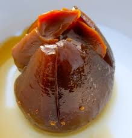

# Brevas con Arequipe

*Colombian dessert of fresh figs poached in spiced sugar syrup, then split open and stuffed with arequipe (Colombian dulce de leche). The figs hold their shape; the syrup soaks the centres; the arequipe melts a little against the warm fruit. Eaten warm or cold, often with a small wedge of mild white cheese on the side.*

**Serves:** 6

**Prep Time:** 10 minutes

**Cook Time:** 1 hour 10 minutes (plus 30 min cooling)

## Overview
Whole brown figs simmer slowly in a syrup of brown sugar, water, cinnamon and cloves until they're tender and the syrup has thickened to glossy. Off the heat, each fig gets cut almost through and stuffed with a generous spoonful of arequipe. Served warm or chilled, with extra syrup spooned over.

## Ingredients

### Figs
- 12 fresh brown figs (firm-ripe; the slightly under-ripe ones hold up best)
- 250 g panela or dark brown sugar
- 500 ml water
- 1 cinnamon stick
- 4 cloves
- 1 strip orange peel
- 1 tablespoon lemon juice

### Filling
- 250 g arequipe (Colombian dulce de leche; or Argentine/Mexican dulce de leche)

### To serve
- 200 g queso fresco or mild feta (cubed; optional but classic)
- A few pistachios (chopped, optional)

## Method

### Stage 1 – Trim the figs
1. Trim the woody stem from each fig but leave the rest of the body intact.
1. Pierce each fig three or four times with a toothpick (helps the syrup penetrate).

### Stage 2 – Syrup
1. Combine the panela, water, cinnamon, cloves, orange peel and lemon juice in a wide pan.
1. Stir over medium heat until the sugar dissolves; bring to a simmer.

### Stage 3 – Poach
1. Lay the figs in a single layer in the syrup.
1. Reduce to lowest heat; simmer very gently 50-60 minutes, basting occasionally with the syrup. The figs should be tender all the way through (a knife slides in easily) and the syrup reduced and glossy.
1. Off the heat, let the figs cool in the syrup 30 minutes — they continue absorbing flavour.

### Stage 4 – Fill
1. Lift the figs out carefully (a slotted spoon and gentle hands).
1. With a small knife, cut each fig almost through from the top, like a flower opening.
1. Spoon a generous teaspoon of arequipe into each cut.

### Stage 5 – Serve
1. Place 2 figs per plate.
1. Drizzle with the reduced syrup.
1. Add cubes of queso fresco if using; scatter pistachios.
1. Eat warm or chilled — both are correct.

## Notes
- **Panela vs brown sugar:** Panela (unrefined cane sugar from Colombia) gives a deeper, almost molasses flavour. Dark brown sugar is the next-best substitute.
- **Don't over-poach:** The figs should hold shape. If they collapse, the syrup is fine but the dish becomes more compote than fig dessert.
- **Cheese alongside:** Sounds odd; works perfectly. The mild salt of fresh white cheese balances the sweetness. Worth trying at least once.

## Storage
- Keeps 5 days refrigerated; flavour deepens. Bring back to room temperature or warm gently before serving.
