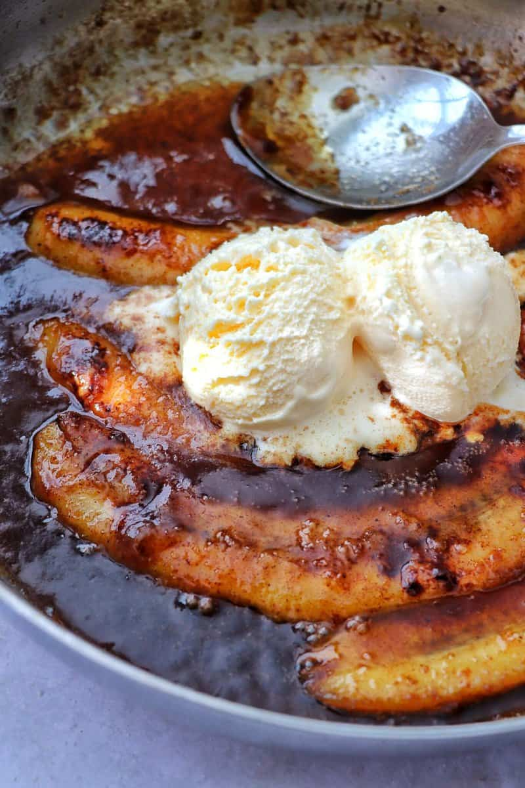

# Bananas Foster

*New Orleans' theatrical dessert: bananas sautéed in butter, brown sugar and rum, flambéed at the table, then poured over vanilla ice cream. Invented at Brennan's restaurant in 1951, named for a friend of the owner. The rum flame is the show; the buttery cinnamon-rum syrup is the substance.*

**Serves:** 4

**Prep Time:** 5 minutes

**Cook Time:** 8 minutes

## Overview
Brown sugar and butter melt in a wide pan; bananas split lengthwise then halved go in cut-side down; cinnamon and a splash of banana liqueur (or extra rum) join. Dark rum pours in and flames briefly — until burnt off. The pan-syrup, slightly thickened, spoons over generous scoops of vanilla ice cream.

## Ingredients

- 4 firm-ripe bananas (yellow with no spots)
- 80 g unsalted butter
- 100 g light brown sugar
- 1 teaspoon ground cinnamon
- ¼ teaspoon ground nutmeg (optional)
- 4 tablespoons banana liqueur (or extra dark rum)
- 6 tablespoons dark rum

### To serve
- 4 generous scoops vanilla ice cream

## Method

### Stage 1 – Prep bananas
1. Peel each banana; cut in half crosswise; cut each half lengthwise. You'll have 4 spears per banana.

### Stage 2 – Caramel base
1. Melt the butter in a wide heavy pan over medium heat (don't use non-stick; you need to flambé).
1. Add the brown sugar; stir to dissolve.
1. Cook 2 minutes until bubbling and slightly thickened.

### Stage 3 – Bananas
1. Add the cinnamon and nutmeg; stir.
1. Lay the banana spears in the pan, cut-side down.
1. Cook 90 seconds; flip carefully; cook another 60 seconds.

### Stage 4 – Banana liqueur
1. Pour the banana liqueur into the pan; stir to coat.
1. The bananas should be just-tender — about to lose their shape but not yet collapsed.

### Stage 5 – Flambé
1. Pour the dark rum carefully into the pan.
1. With long matches, ignite — at the surface — and stand back.
1. The flames will burn 30-60 seconds; let them die naturally.
1. The remaining sauce will be slightly reduced and intense.

### Stage 6 – Serve
1. Place a generous scoop of vanilla ice cream in each bowl.
1. Spoon over the bananas with their syrup, dividing evenly.
1. The hot syrup melts the ice cream; the bananas hold soft.
1. Eat immediately.

## Notes
- **Firm-ripe bananas:** Soft, spotty bananas collapse into mush. Yellow with no brown spots is right.
- **Flambé safely:** Pull the pan off the heat first, pour rum, then ignite at arm's length with long matches or a long lighter. Don't pour rum from the bottle into a flaming pan — flame can travel up the pour and ignite the bottle.
- **Don't overcook:** The bananas should hold their shape. Cooking too long turns them to porridge.

## Storage
- Eat immediately. Doesn't keep — the bananas brown and the syrup hardens.
