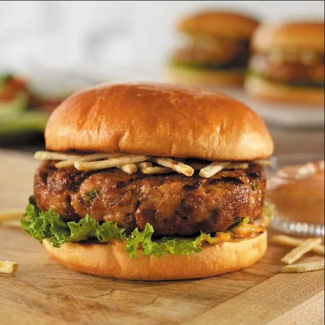

# Cuban-Style Pork Burgers

*A beloved Cuban street food that combines seasoned ground pork with Spanish chorizo, served with crispy shoestring potatoes and dressed with tangy thousand island dressing, all sandwiched in a toasted bun.*

**Serves:** 6

## Overview
These Cuban-style burgers are a vibrant fusion of Spanish and Cuban influences, featuring tender pork patties infused with spicy chorizo, aromatic garlic, and fresh peppers. The patties are griddled to perfection and served with a distinctive potato filling and creamy dressing that makes them distinctly Cuban. The combination of flavors, savory, spicy, and tangy, makes this a signature Cuban comfort food.

## Ingredients

### Burger Patties
- 27 grams Spanish chorizo
- 454 grams pork mince
- 36 grams dried bread crumbs
- 1 large egg (beaten)
- 1 small yellow onion (minced)
- 50 grams green bell pepper (minced)
- 1 clove garlic (minced)
- 1/4 tsp. kosher salt

### Assembly
- 6 hamburger buns (split)
- 6 Tbsp. thousand island dressing
- 300 grams potatoes (shoestring, potato sticks)
- 6 lettuce leaves (green)

## Method

### Stage 1 – Prepare Patties
1. Finely chop chorizo in a food processor or with a large knife.
2. Gently mix together ground pork, chopped chorizo, breadcrumbs, egg, onion, green pepper, garlic and salt until just combined.
3. Shape into 6 patties about 3/4-inch thick.
4. Refrigerate for 10 to 15 minutes to firm up.

### Stage 2 – Cook Burgers
1. Place a griddle pan over a medium-high heat until it becomes hot.
2. Place burgers in the pan and cover.
3. Grill burgers for 5 minutes.
4. Turn and finish cooking for 4 to 5 minutes more, until cooked through.

### Stage 3 – Toast & Assemble
1. Toast buns about 1 minute per side until lightly golden.
2. Build burgers on buns with 1 1/2 tablespoons dressing, 1/3 cup shoestring potatoes and one lettuce leaf.

## Notes
- **Chorizo Preparation:** Spanish chorizo adds authentic Cuban flavor; ensure it's finely chopped and well incorporated for consistent spicing throughout the patty.
- **Temperature Control:** Medium-high heat is crucial, too high will burn the outside while leaving the inside undercooked; too low will result in dry patties.
- **Refrigeration:** Chilling the patties helps them hold together during cooking and improves texture.
- **Potato Component:** The shoestring potatoes are essential to the Cuban burger experience; they add textural contrast and are a defining characteristic of this dish.

## Variations
**With Swiss Cheese:** Add a slice of Swiss cheese to each patty after flipping; cover and cook 1-2 minutes more until melted.
**Citrus Marinade:** Marinate minced garlic and onion in lime and orange juice for 30 minutes before adding to the meat mixture for enhanced Cuban flavor.

## Serving
Serve with: Crispy shoestring potatoes, pickled onions, or a simple side salad
Garnish with: Fresh cilantro, additional jalapeños for heat, or fresh lime wedges

## Storage
- Keeps 3-4 days refrigerated (store patties and assembly components separately)
- Freezes well up to 2 months (freeze uncooked patties with parchment between each)
- Best eaten immediately after assembly for optimal texture of potatoes and bun
