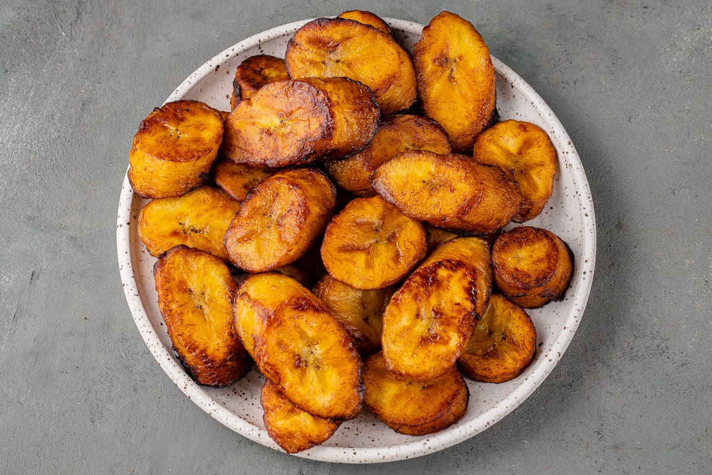

# Plátanos Maduros

*Sweet ripe plantains, sliced and pan-fried until the edges caramelise to deep mahogany and the centres turn jammy and almost custard-like. The Cuban side that doubles as a dessert, depending on how you look at it.*

**Serves:** 4

**Prep Time:** 5 minutes

**Cook Time:** 10 minutes

## Overview
Very ripe (black-spotted, almost fully black) plantains are sliced thick on the diagonal and pan-fried in oil. The natural sugars caramelise; the inside softens to spoonable. A pinch of salt at the end balances the sweetness.

## Ingredients

- 3 very ripe plantains (the skins should be mostly black with deep yellow underneath)
- 4 tablespoons vegetable or sunflower oil (for shallow frying)
- A pinch of flaky sea salt
- A pinch of ground cinnamon (optional)

## Method

### Stage 1 – Slice
1. Trim the ends; score the skins lengthwise; peel away.
1. Cut the plantains on a 45-degree diagonal into 1.5 cm slices.

### Stage 2 – Fry
1. Heat the oil in a heavy frying pan over medium heat (the oil should shimmer but not smoke).
1. Add the plantain slices in a single layer; don't crowd. Fry 2-3 minutes per side until deep mahogany — almost burnt-looking — and the cut faces caramelised.
1. Lower the heat slightly if they brown too fast (the inside needs to soften before the outside burns).

### Stage 3 – Drain and finish
1. Lift onto kitchen paper to drain.
1. Sprinkle with flaky salt and a tiny pinch of cinnamon if using.

## Notes
- **Ripeness is everything:** Yellow plantains with no black spots are too starchy and bland; they fry to firm bricks instead of soft jammy slices. The riper the better — heavily black-skinned ones give the most caramelisation.
- **Don't crowd the pan:** Steam-fries instead of caramelising. Cook in batches.
- **Salt the right amount:** Plantains are sweet; a little salt brings them into focus. Too much and you've made a confused side dish.

## Storage
- Best eaten immediately. Leftovers refrigerate 2 days; re-crisp in a dry pan or oven (don't microwave; goes soggy).
