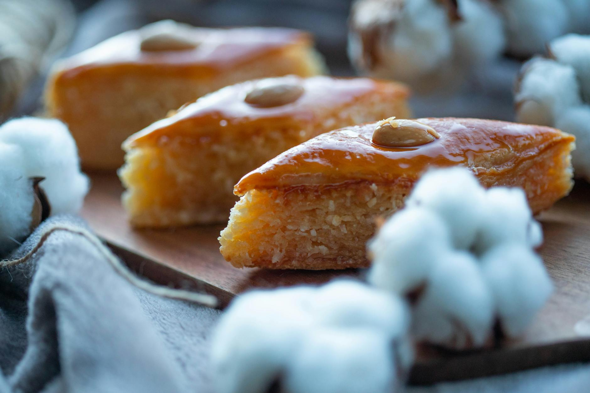

# Basbousa

*Egyptian semolina cake soaked in hot orange-blossom or rose syrup, golden on top, almost custardy beneath. Eaten across the Levant and North Africa under different names (revani in Turkey, hareeseh in Lebanon); the Egyptian version leans coconut-rich, with a glossy syrup that drowns the cake while it's still hot from the oven.*

**Serves:** 12

**Prep Time:** 15 minutes

**Cook Time:** 35 minutes

## Overview
A simple batter of semolina, yogurt, sugar, butter and coconut bakes in a shallow tray. The classic move: cut into diamonds before baking so the syrup soaks through the cuts later. Hot syrup pours over the warm cake and disappears in seconds, leaving the surface tacky-glossy. Topped with a single almond on each diamond.

## Ingredients

### Cake
- 400 g fine semolina
- 200 g desiccated coconut
- 300 g caster sugar
- 200 g plain yogurt
- 200 g unsalted butter (melted)
- 1 teaspoon baking powder
- 1 teaspoon vanilla extract
- 4 tablespoons milk (if needed)
- About 24 blanched almonds

### Syrup
- 400 g caster sugar
- 250 ml water
- 1 tablespoon lemon juice
- 1 tablespoon orange blossom water (or rosewater)

## Method

### Stage 1 – Syrup
1. Combine the sugar, water and lemon juice in a small pan.
1. Bring to the boil; simmer 8-10 minutes until slightly thickened.
1. Off the heat, stir in the orange blossom water.
1. Keep hot.

### Stage 2 – Batter
1. Heat the oven to 180°C (160°C fan).
1. Whisk the semolina, coconut, sugar and baking powder.
1. Stir in the yogurt, melted butter and vanilla.
1. The mixture should be thick but spreadable; add a splash of milk if it's too dry.

### Stage 3 – Shape and score
1. Butter a 23 x 33 cm baking tin.
1. Spread the batter evenly; smooth the top with a wet spatula.
1. With a sharp knife, score the batter into diamonds (about 6 cm across) — cut all the way through to the bottom.
1. Press a blanched almond into the centre of each diamond.

### Stage 4 – Bake
1. Bake 30-35 minutes until deep golden on top and pulling slightly from the edges.

### Stage 5 – Drown in syrup
1. As soon as it comes out of the oven, slowly pour the hot syrup all over — let it run into every cut.
1. The cake will absorb most of it within minutes.

### Stage 6 – Cool and serve
1. Cool 30 minutes in the tin (the syrup distributes; the texture sets).
1. Lift the diamonds out; serve at room temperature.

## Notes
- **Hot cake, hot syrup, but not boiling:** Both should be hot for max absorption. Boiling syrup poured on can crack the surface; very hot is right.
- **Score before baking:** Trying to cut after pouring syrup gives ragged edges and uneven slices. Pre-cut diamonds slice clean.
- **Don't overbake:** A drying basbousa absorbs less syrup, ends up dry. Pull when the centre still feels just-set, not firm.

## Storage
- Keeps 5 days in an airtight tin; eats well at room temperature. Texture improves by day 2.
