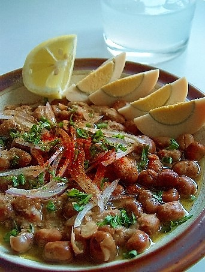

# Ful Medames

*Egypt's national breakfast: dried fava beans slow-cooked with garlic, lemon, cumin and olive oil into a rough mash, eaten warm with bread, eggs, tomato, onion and chilli. Sold from carts across Cairo; cooked overnight in tall copper pots called qidra. Cheap, ancient, deeply nourishing.*

**Serves:** 4

**Prep Time:** 10 minutes (plus overnight bean soak)

**Cook Time:** 2 hours

## Overview
Whole dried fava beans soak overnight, then simmer slowly until the skins soften and the beans are completely tender — they'll break down on the edges, stay whole at the heart. Garlic, lemon, cumin and salt mash through; a generous pour of olive oil at the end. Tomato, onion, parsley and a hard-boiled egg or two on top.

## Ingredients

### Beans
- 350 g dried fava beans (whole, brown skinned; soaked overnight) or 2 x 400 g tins
- 1 bay leaf
- 1 teaspoon ground cumin
- ½ teaspoon ground coriander

### To finish
- 6 garlic cloves (crushed to paste with a pinch of salt)
- Juice of 2 lemons
- 1 teaspoon ground cumin
- ½ teaspoon hot paprika or chilli flakes
- 1 teaspoon salt (or to taste)
- 5 tablespoons extra-virgin olive oil
- 4 hard-boiled eggs (halved, optional)

### Toppings
- 2 medium tomatoes (diced)
- 1 small red onion (finely chopped)
- A small bunch of flat-leaf parsley (chopped)
- 4 tablespoons tahini sauce (optional)
- Pickled chillies
- Warm pita or aysh baladi (Egyptian bread)

## Method

### Stage 1 – Cook the beans (if using dried)
1. Drain the soaked beans; cover with fresh water by 5 cm.
1. Add the bay leaf, cumin and coriander.
1. Bring to the boil; reduce to a steady simmer; cook 1½-2 hours until completely tender.
1. Reserve some of the cooking liquid.

### Stage 2 – If using tinned, just heat
1. Drain the tins; place beans in a pan with 200 ml water; warm through 5 minutes.

### Stage 3 – Season
1. Off the heat, mash about a third of the beans roughly against the side of the pan with a wooden spoon; leave the rest whole.
1. Stir in the crushed garlic, lemon juice, cumin, paprika and salt.
1. Add bean cooking liquid (or hot water) to loosen to a thick stew — should hold a furrow but not be dry.
1. Drizzle in 3 tablespoons of the olive oil; stir.

### Stage 4 – Serve
1. Pile into 4 bowls.
1. Top with diced tomato, chopped onion, parsley and pickled chillies.
1. Place hard-boiled egg halves on top.
1. Drizzle generously with the remaining olive oil.
1. Serve with warm bread and tahini sauce on the side.

## Notes
- **Dried beans give the proper texture:** Tinned ful medames are softer and more uniform; the dried version gives the mix of soft mash and intact whole beans that defines the dish.
- **Skin tenderness varies:** Some Egyptian markets sell skinned ful (hard-cooked, fast). Whole brown-skinned beans need the long simmer.
- **Cold leftovers:** Many Egyptians eat ful cold the next day for breakfast, scooped into bread.

## Storage
- Keeps 4 days refrigerated; eats well cold or reheated.
- Freezes 3 months.
