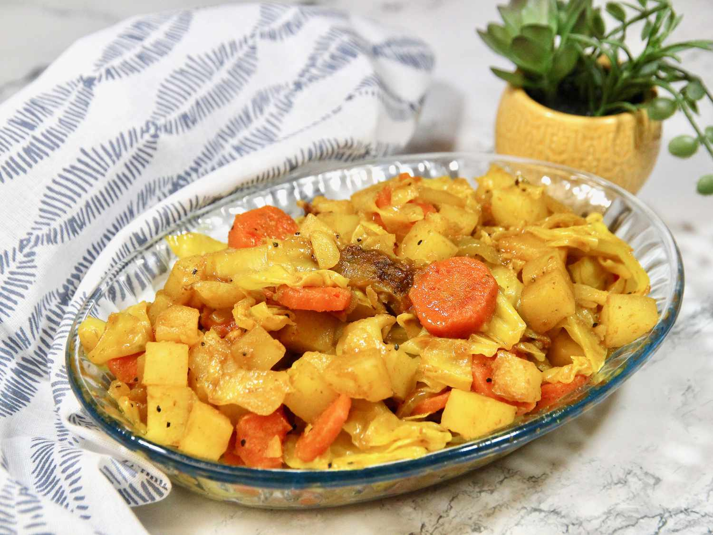

# Atakilt Wat

*Ethiopia's spiced cabbage, carrots and potatoes — bright with turmeric, fragrant with ginger, the vegetables stewed slowly until they meld and the cabbage almost disappears into the sauce. Mild compared to the berbere-heavy stews; cooling against them on a shared platter.*

**Serves:** 4

**Prep Time:** 15 minutes

**Cook Time:** 35 minutes

## Overview
Onions soften in oil with turmeric. Garlic, ginger and a small amount of berbere season. Carrots and potatoes go in first to soften; cabbage joins later. Steam-cooks under a lid until tender; the volume halves and the flavours fuse.

## Ingredients

- 2 medium onions (sliced)
- 60 ml vegetable oil
- 1 teaspoon ground turmeric
- 4 garlic cloves (crushed)
- 2 cm fresh ginger (grated)
- 1 teaspoon berbere (optional, for heat)
- 3 medium carrots (cut into 1 cm batons)
- 3 medium potatoes (peeled and cut into 2 cm chunks)
- ½ medium green cabbage (about 600 g; sliced 1 cm thick)
- 1 teaspoon salt
- 100 ml water
- Black pepper

## Method

### Stage 1 – Onions
1. Heat the oil in a wide heavy pan over medium heat.
1. Add the onions and turmeric; cook 8-10 minutes until soft and golden.

### Stage 2 – Aromatics
1. Stir in the garlic, ginger and berbere if using; cook 1 minute.

### Stage 3 – Carrots and potatoes
1. Add the carrots and potatoes; toss to coat in the spiced oil.
1. Pour in the water; cover and cook 10 minutes (the steam softens them while the oil flavours them).

### Stage 4 – Cabbage
1. Pile in the cabbage; add the salt; toss.
1. Cover and cook 12-15 minutes, stirring once or twice, until the cabbage has wilted right down and the potatoes are tender. The vegetables should be soft, just-coated, almost dry.

### Stage 5 – Finish
1. Taste and adjust salt; grind in black pepper.
1. Serve warm with injera or rice.

## Notes
- **Cabbage volume:** Looks impossible at first; collapses to about a third under the lid. Trust it.
- **Potato size:** Cut chunks slightly larger than the carrot pieces — they cook a touch faster, so the slightly larger size keeps them from breaking down.
- **Turmeric matters:** It's not just for colour; it gives the dish its mild earthy backbone.

## Storage
- Keeps 4 days refrigerated; reheats well in a pan with a splash of water.
- Freezes 2 months but the cabbage texture suffers; better fresh.
