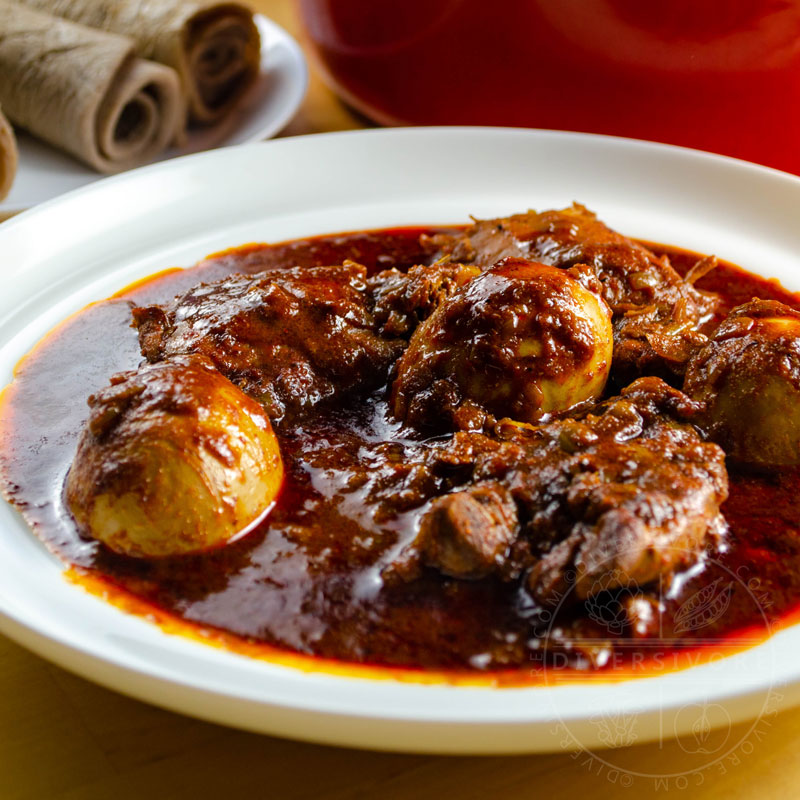

# Doro Wat

*Ethiopian spiced chicken stew: chicken legs simmered in a thick, deep red sauce of caramelised onions, berbere spice and niter kibbeh (spiced clarified butter), with hard-boiled eggs poached in the sauce. The national dish; festive food, served with injera flatbread to scoop with.*

**Serves:** 4-6

**Prep Time:** 30 minutes

**Cook Time:** 1½ hours

## Overview
Onions cook down for nearly an hour into a deep dark base — this is the foundation of doro wat and shouldn't be rushed. Berbere (Ethiopian spice blend) and niter kibbeh fold in. Chicken thighs and legs simmer in the sauce; hard-boiled eggs join late, taking on the deep red colour. Eaten communally from a single platter with injera; tears of injera scoop the stew.

## Ingredients

### Niter kibbeh (spiced butter)
- 250 g unsalted butter
- 2 garlic cloves (crushed)
- 1 thumb fresh ginger (sliced)
- 1 small onion (chopped)
- 1 teaspoon fenugreek seeds
- 1 teaspoon cumin seeds
- 1 teaspoon coriander seeds
- 1 cinnamon stick
- 4 cardamom pods (cracked)

### Stew
- 4 large red onions (very finely chopped — about 800 g)
- 4 tablespoons niter kibbeh (from above)
- 1 thumb fresh ginger (grated)
- 6 garlic cloves (crushed)
- 4 tablespoons berbere spice mix (Ethiopian; or homemade — see notes)
- 2 tablespoons tomato purée
- 100 ml dry red wine (optional)
- 500 ml chicken stock
- 1 kg chicken thighs and drumsticks (skinned)
- Juice of 1 lemon
- 6 hard-boiled eggs (peeled, scored shallow lengthwise)
- Salt

### To serve
- 4-6 sheets of injera (Ethiopian sourdough flatbread; from any East African grocer)

## Method

### Stage 1 – Niter kibbeh
1. Melt the butter slowly in a small pan with all the spice ingredients.
1. Heat very gently for 20 minutes (don't simmer; warm) so the milk solids settle and the spices infuse.
1. Strain through muslin into a jar; discard the solids and the bottom layer.
1. (Will keep 2 months refrigerated; use the rest in any Ethiopian dish.)

### Stage 2 – Cook the onions
1. Place the chopped onions in a large heavy pot WITHOUT any oil.
1. Cook over medium-low heat, stirring occasionally, for 30-40 minutes until they're very soft, dark and have lost most of their volume.
1. Add 4 tablespoons niter kibbeh; cook another 10 minutes.

### Stage 3 – Build the sauce
1. Add the ginger and garlic; cook 1 minute.
1. Stir in the berbere; cook 2-3 minutes (don't burn).
1. Add the tomato purée; cook 2 minutes.
1. Pour in the wine; reduce by half.
1. Add the stock; bring to a simmer.

### Stage 4 – Chicken
1. Add the skinned chicken pieces; turn to coat in the sauce.
1. Squeeze in the lemon juice.
1. Cover and simmer 35-40 minutes until tender.

### Stage 5 – Eggs
1. Add the scored hard-boiled eggs; spoon sauce over.
1. Simmer uncovered another 10 minutes; the eggs absorb the colour.

### Stage 6 – Serve
1. Spread injera sheets across a large platter.
1. Spoon the doro wat into the centre.
1. Set extra rolled injera on the side.
1. Eat with hands: tear injera, pinch up bites of stew.

## Notes
- **The onions are 50% of the dish:** No oil, slow cook, until very dark. This is what makes doro wat doro wat. Don't shortcut.
- **Berbere shop-bought:** Pre-blended berbere from Ethiopian grocers is excellent. Homemade involves toasting and grinding 12+ spices.
- **Skin the chicken:** Doro wat doesn't have skin in the sauce; skin gets removed before simmering.

## Storage
- Improves overnight. Keeps 4 days refrigerated.
- Freezes 3 months.
