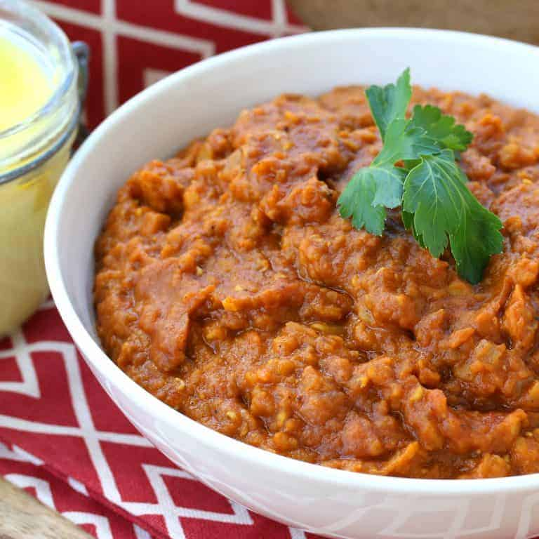

# Misir Wat

*Ethiopia's red lentil stew: bright orange from berbere, deep with onion that's been cooked nearly to nothing, and rich with niter kibbeh (spiced butter). Eaten by mopping with injera; vegan if made with oil instead of butter.*

**Serves:** 4

**Prep Time:** 15 minutes

**Cook Time:** 50 minutes

## Overview
Onions cook slowly in oil or niter kibbeh until they melt and turn jammy. Berbere blooms in. Tomato paste deepens; lentils and water simmer until soft and the stew thickens. Lemon juice at the end brightens.

## Ingredients

- 3 large onions (very finely chopped)
- 60 ml vegetable oil (or 50 g niter kibbeh; see notes)
- 6 garlic cloves (crushed)
- 2 cm fresh ginger (grated)
- 3 tablespoons berbere spice mix
- 2 tablespoons tomato paste
- 250 g red lentils (rinsed)
- 1 litre vegetable stock (or water)
- 1 teaspoon salt (or to taste)
- Juice of half a lemon
- Black pepper

## Method

### Stage 1 – Onions
1. Cook the onions in a dry heavy saucepan over medium-low heat with no oil for the first 15 minutes, stirring often. They release water and start to break down.
1. Add the oil (or niter kibbeh); cook another 15 minutes until deep brown, jammy and almost paste-like.

### Stage 2 – Bloom
1. Add the garlic, ginger and berbere; cook 1 minute (it should smell intense but not burn).
1. Stir in the tomato paste; cook 2 minutes until darkened.

### Stage 3 – Lentils
1. Add the lentils and stock; bring to the boil; reduce to a simmer.
1. Cook 25-30 minutes, stirring occasionally, until the lentils have completely broken down and the stew is thick enough to hold a furrow when you draw a spoon through.
1. Top up with hot water if it tightens too much.

### Stage 4 – Finish
1. Off the heat, stir in the lemon juice and salt to taste; grind in plenty of black pepper.
1. Serve with injera (Ethiopian flatbread) or rice.

## Notes
- **Niter kibbeh vs oil:** Niter kibbeh — clarified butter spiced with cardamom, fenugreek and aromatics — gives the authentic flavour. Oil makes it vegan and still excellent.
- **Berbere strength varies:** Some blends are mild; others are searing. Start with 2 tablespoons and add more after tasting at Stage 3.
- **The dry-onion start:** Dry-cooking onions before adding fat is the Ethiopian technique. They break down faster and end up sweeter; doesn't burn because they're releasing moisture.

## Storage
- Keeps 5 days refrigerated; the flavour improves overnight.
- Freezes 3 months.
