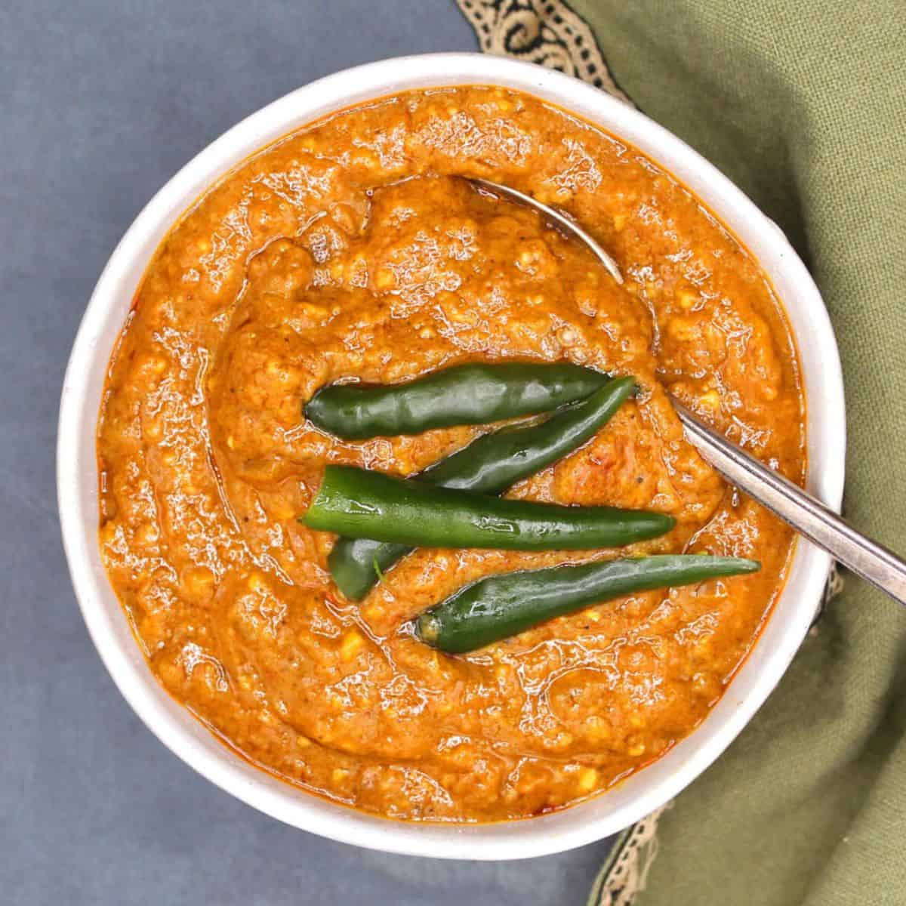

# Shiro Wat

*A creamy Ethiopian chickpea-flour stew: chickpea flour whisked into spiced onion and tomato until it thickens to a smooth, savoury, paprika-orange porridge. The everyday vegan main of Ethiopia, eaten constantly during fasting periods.*

**Serves:** 4

**Prep Time:** 10 minutes

**Cook Time:** 30 minutes

## Overview
Onion melts in oil; berbere and tomato bloom in; water joins. Chickpea flour is whisked through, then cooked steadily, stirring, until thick and silky. The longer it cooks, the richer it tastes.

## Ingredients

- 2 large onions (very finely chopped)
- 60 ml vegetable oil
- 5 garlic cloves (crushed)
- 2 cm fresh ginger (grated)
- 2 tablespoons berbere
- 2 tablespoons tomato paste
- 600 ml hot water (or vegetable stock)
- 100 g chickpea (gram) flour
- 1 teaspoon salt (or to taste)
- Black pepper

## Method

### Stage 1 – Onions
1. Cook the onions dry in a heavy saucepan over medium-low heat for 10 minutes, stirring often.
1. Add the oil; continue 10 minutes until deep golden and very soft.

### Stage 2 – Bloom
1. Add the garlic, ginger, berbere and tomato paste; cook 2 minutes.

### Stage 3 – Build
1. Pour in the hot water, whisking. Bring to a steady simmer.
1. Whisk in the chickpea flour gradually, breaking up any lumps. The mixture thickens almost immediately.
1. Reduce the heat; cook 10-15 minutes, stirring often, until smooth, glossy and thick enough to hold a spoon trail.
1. Add hot water bit by bit if it tightens too far.

### Stage 4 – Finish
1. Stir in salt to taste; grind in black pepper.
1. Drizzle with extra oil at the table; serve with injera or rice.

## Notes
- **Whisk in the flour off heat:** Or hold the heat low — boil-in causes lumps. A wire whisk and steady pour gets you a smooth result.
- **Texture is personal:** Some like it pourable like thick gravy, others prefer almost spreadable. Adjust water to taste.
- **Berbere makes it:** Without good berbere this is bland chickpea-flour soup. The spice blend is non-negotiable.

## Storage
- Keeps 4 days refrigerated; thickens further on cooling — loosen with hot water on reheat.
- Freezes 2 months; texture is fine if whisked while reheating.
