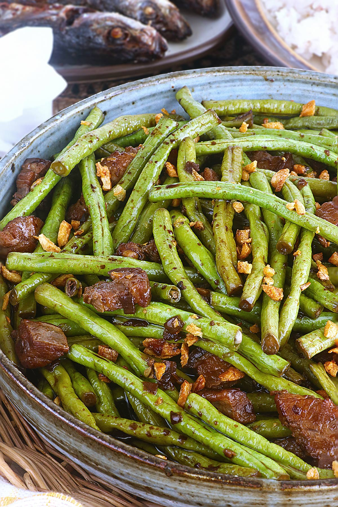

# Adobong Sitaw

*Long beans braised adobo-style: vinegar, soy sauce, garlic, bay and pepper. The beans tenderise in the liquid; everything reduces to a glossy, sharp, savoury glaze. Filipino vegetable cooking at its most direct.*

**Serves:** 4

**Prep Time:** 5 minutes

**Cook Time:** 20 minutes

## Overview
Garlic browns in oil; long beans toss in to colour briefly. Soy and vinegar pour in with bay and peppercorns; the beans braise covered until tender. Lid off; the liquid reduces to a glaze. Salt at the end, not the start, since soy is salty enough.

## Ingredients

- 500 g long beans (or green beans; cut into 8 cm lengths)
- 3 tablespoons vegetable oil
- 8 garlic cloves (crushed)
- 1 small onion (sliced)
- 60 ml light soy sauce
- 60 ml white cane vinegar (or rice vinegar)
- 2 bay leaves
- 1 teaspoon whole black peppercorns (lightly cracked)
- 200 ml water
- 1 teaspoon sugar
- Cooked rice (to serve)

## Method

### Stage 1 – Aromatics
1. Heat the oil in a wide heavy pan over medium-high heat.
1. Add the garlic; cook 1-2 minutes until fragrant and just starting to colour.
1. Add the onion; cook 2 minutes.

### Stage 2 – Beans
1. Pile in the long beans; toss to coat in the oil; cook 2-3 minutes until they go bright green and start to blister.

### Stage 3 – Braise
1. Pour in the soy, vinegar, water; add the bay and peppercorns.
1. Bring to a boil; do not stir for 1 minute (lets the vinegar's harshness cook off).
1. Reduce the heat; cover and simmer 8 minutes until the beans are tender but still have a faint snap.

### Stage 4 – Reduce
1. Uncover; raise the heat to medium-high.
1. Cook 4-5 minutes more until the liquid reduces to a glossy sauce that just coats the beans.
1. Stir in the sugar to round out the vinegar.
1. Taste; adjust soy if it needs salt.

### Stage 5 – Serve
1. Discard the bay; serve hot with steamed rice.

## Notes
- **Don't stir the vinegar in:** Filipino tradition holds that stirring the vinegar before it boils makes the dish taste raw and sharp. Let it bubble for a minute first.
- **Long beans (sitaw) vs green beans:** Long beans hold up best; green beans work fine but cook faster — check at 6 minutes.
- **Sugar at the end:** Balances the vinegar without adding sweetness up front.

## Storage
- Keeps 3 days refrigerated; flavour deepens overnight.
- Doesn't freeze well; the beans go limp.
