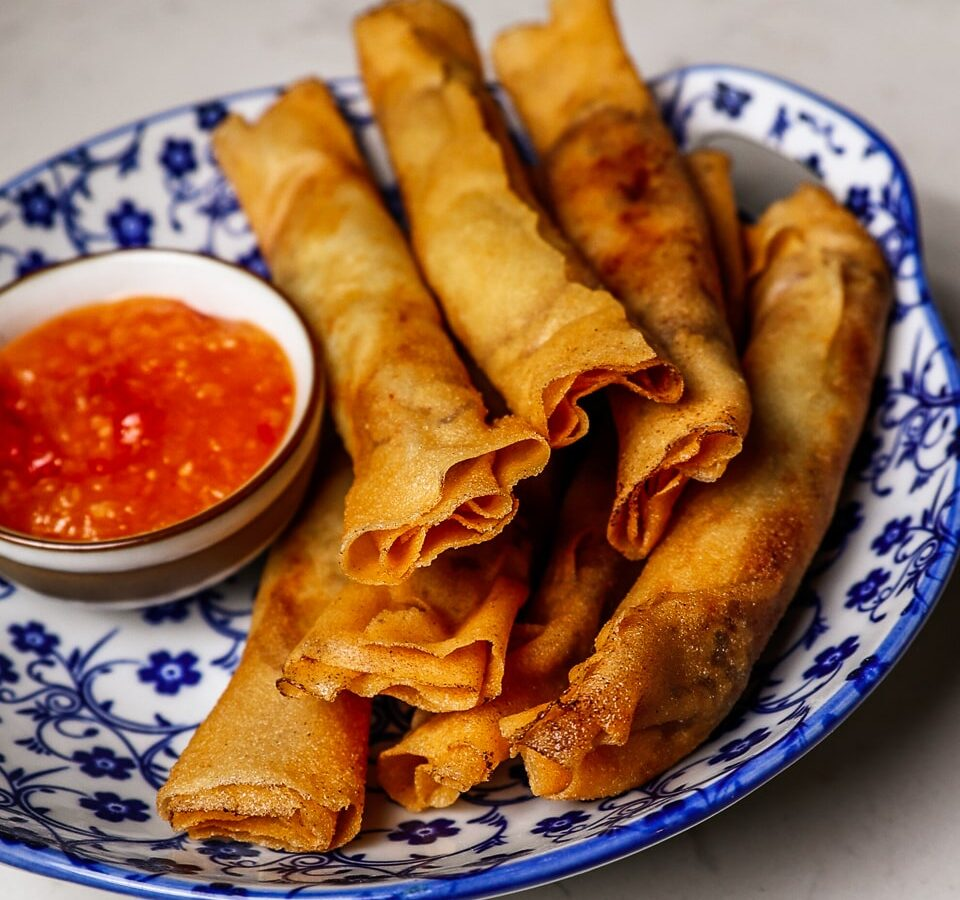

# Lumpia Shanghai

*Filipino crisp pork-and-vegetable spring rolls: thin, finger-sized, deep-fried golden. Served with a sweet-sour dipping sauce or banana ketchup. Birthday-party staple, snack-time staple, every-occasion staple.*

**Makes:** 30 lumpia

**Prep Time:** 40 minutes

**Cook Time:** 15 minutes

## Overview
A pork-mince filling with carrot, onion, garlic, soy and pepper rolls tightly into thin spring-roll wrappers, finger-sized. Deep-fries golden in 4 minutes. The wrappers are key — Filipino lumpia wrappers are thinner than Chinese spring-roll skins and crisp differently.

## Ingredients

### Filling
- 500 g pork mince
- 1 small onion (very finely chopped)
- 1 carrot (very finely grated)
- 4 garlic cloves (crushed)
- 2 spring onions (very finely chopped)
- 1 large egg
- 2 tablespoons soy sauce
- 1 teaspoon ground white pepper
- 1 teaspoon salt
- 1 teaspoon sugar
- 2 teaspoons toasted sesame oil

### To wrap and fry
- 30 lumpia wrappers (Filipino-style; thawed from frozen if needed)
- 1 small bowl of water (for sealing edges)
- Vegetable oil for deep-frying

### Dipping sauce
- 4 tablespoons sweet chilli sauce (or banana ketchup)
- 1 tablespoon rice vinegar
- 1 teaspoon soy sauce

## Method

### Stage 1 – Filling
1. Combine all filling ingredients in a bowl.
1. Knead with your hands for 2-3 minutes until cohesive and slightly tacky.

### Stage 2 – Wrap
1. Place a wrapper on the work surface in a diamond orientation.
1. Spoon a finger-shaped mound of filling (about 1 tablespoon) along the lower edge.
1. Fold the bottom corner up over the filling.
1. Fold the left and right corners inward.
1. Roll up tightly toward the top corner; seal the seam with a dab of water.
1. Set on a tray seam-side down; repeat. Cover with a damp cloth as you go.

### Stage 3 – Fry
1. Heat oil to 175°C in a deep pan.
1. Fry lumpia in batches of 6-8 for 3-4 minutes, turning, until deep golden.
1. Drain on a wire rack.

### Stage 4 – Sauce
1. Whisk all dipping sauce ingredients in a bowl.

### Stage 5 – Serve
1. Pile the lumpia on a plate or platter.
1. Place the dipping sauce alongside.
1. Eat hot.

## Notes
- **Filipino lumpia wrappers:** Thinner and crisper than Chinese spring-roll wrappers. If you can't find them, Chinese ones work but the texture is slightly different.
- **Tight roll:** Loose rolls trap air and burst in the oil.
- **Make in batches; freeze raw:** Open-freeze rolled lumpia on a tray, then bag. Cook from frozen, adding 1-2 minutes.

## Storage
- Eat fresh from the fryer.
- Raw rolled lumpia freeze 3 months.
- Cooked keep 1 day; reheat at 180°C for 5 minutes (won't be quite as crisp).
