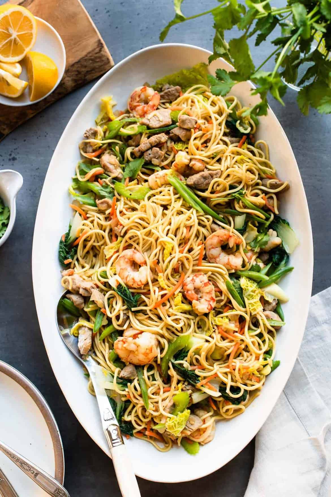

# Pancit Canton

*Filipino stir-fried noodles: wheat noodles tossed with chicken, prawns, Chinese sausage and a colourful array of vegetables in a soy-oyster sauce. Filipino fiesta food; the noodles symbolise long life. Cooked in a wok in 15 minutes.*

**Serves:** 4-6

**Prep Time:** 15 minutes

**Cook Time:** 20 minutes

## Overview
Aromatics fry, then chicken and prawns sauté fast. Vegetables and Chinese sausage join. The noodles soak briefly to soften, then go in the wok with sauce and stock to absorb everything in 5 minutes. Lemon or kalamansi at the table.

## Ingredients

- 250 g pancit canton noodles (or thick egg noodles)
- 2 tablespoons vegetable oil
- 1 onion (sliced)
- 4 garlic cloves (crushed)
- 200 g chicken thigh (sliced thin)
- 200 g raw prawns (peeled)
- 2 Chinese sausages (lap cheong; sliced thin) (or chorizo as substitute)
- 1 carrot (julienned)
- 1 red pepper (sliced)
- 100 g green beans (cut into 3 cm)
- ¼ small cabbage (shredded)
- 4 spring onions (cut into 4 cm)
- 4 tablespoons soy sauce
- 2 tablespoons oyster sauce
- 1 tablespoon fish sauce
- 600 ml chicken stock
- ½ teaspoon ground black pepper
- Lemon or kalamansi wedges, to serve

## Method

### Stage 1 – Soak the noodles
1. Place the noodles in a bowl of warm water for 5 minutes to soften.
1. Drain.

### Stage 2 – Stir-fry the meats
1. Heat the oil in a large wok over high heat.
1. Cook the onion 1 minute; add garlic for 30 seconds.
1. Add the Chinese sausage; stir-fry 1 minute.
1. Add the chicken; stir-fry 3 minutes.
1. Add the prawns; stir-fry 2 minutes until pink. Push everything to one side.

### Stage 3 – Vegetables
1. Add the carrot, pepper and green beans to the cleared space; stir-fry 2 minutes.
1. Add the cabbage; stir-fry 1 minute.

### Stage 4 – Sauce and noodles
1. Pour in the soy, oyster and fish sauces.
1. Add the stock; bring to a simmer.
1. Add the noodles and pepper; toss to combine.
1. Cook 4-5 minutes, tossing, until the liquid is absorbed and the noodles are tender.

### Stage 5 – Finish
1. Stir in the spring onions; cook 30 seconds.
1. Pile onto a platter; serve with lemon wedges.

## Notes
- **Soak briefly, don't fully cook:** The noodles finish in the wok with the sauces, absorbing flavour. Pre-cooked they go gluey.
- **Chinese sausage (lap cheong):** Sweet, dried, distinctive; Filipino versions sometimes use cured sausage (chorizo bilbao). Both work; Spanish chorizo is a fair substitute.
- **High heat throughout:** Stir-fry, not stew. The wok stays smoking; everything gets a quick crispy edge.

## Storage
- Best fresh; the noodles soften on reheating. Keeps 2 days; revive with a splash of stock in a hot pan.
