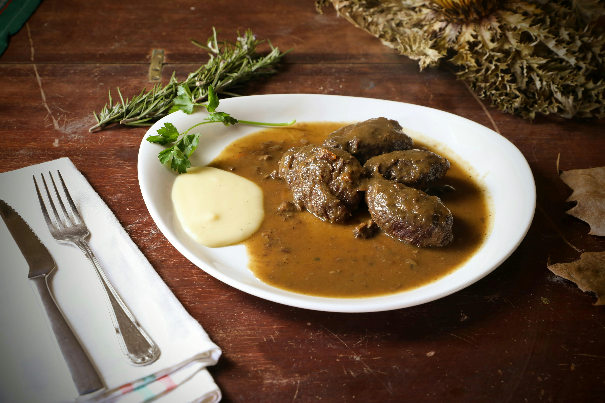

# Beef Bourguignon (Boeuf Bourguignon)

*This classic Burgundy stew was once prepared with whole roasts weighing several kilograms, but modern custom calls for cubed beef cooked more quickly. The rich wine sauce, thickened with just the right amount of flour, transforms humble beef into an elegant centerpiece.*

**Serves:** 4-6

## Overview
Beef Bourguignon is the quintessential French braise, tender beef cubes slow-cooked in a Burgundy wine sauce enriched with pearl onions, mushrooms, and lardons. The combination of wine, beef stock, and a delicate flour thickening creates a deeply savory sauce that clings to the meat. This dish exemplifies classic French technique: patient cooking, careful skimming, and the balance of richness with restraint.

## Ingredients

### Wine & Base
- 1 bottle of red wine (preferably Burgundy)
- 750 ml beef broth
- Peanut oil
- 60 grams butter

### Meat & Aromatics
- 900 grams rump pot roast (cut into 5 cm cubes)
- 2 medium carrots (sliced into 5 mm rounds)
- 2 medium onions (sliced into 5 mm rounds)
- 2 tablespoons flour
- 1 bouquet garni
- 2 cloves garlic (de-germed)
- Crushed pepper
- Salt to taste

### Garnish
- 16 small cippoline onions (peeled)
- 1 teaspoon sea salt
- 1 teaspoon caster sugar
- 125 grams lardons
- 150 grams button cup mushrooms (cleaned and stems trimmed)
- 1 tablespoon parsley (finely chopped)

## Method

### Stage 1 – Reduce Wine & Brown Meat
1. Put the wine in a saucepan and bring to the boil. Simmer gently for 20 minutes until reduced by about one-third.
2. Heat 1 tablespoon of peanut oil in a large saucepan or casserole.
3. Add 45 grams of butter; when it foams, add the cubes of meat.
4. Brown the meat for 5 minutes over medium heat, stirring with a wooden spoon to ensure even searing.
5. Using a skimmer or slotted spoon, remove the meat to a deep dish.

### Stage 2 – Build Sauce Base
1. Put the carrots and onions into the pan and cook for 5 minutes over very low heat, stirring occasionally to prevent darkening.
2. Sprinkle the meat with flour and return it to the pan with crushed black pepper.
3. Turn heat to medium and cook, stirring constantly for 5 minutes to cook out the raw flour taste.
4. Pour half the broth into the pan and stir. Then add the reduced wine and remaining broth until the meat is just covered.
5. Add the bouquet garni and garlic, cover, and simmer gently for 2 hours, skimming foam and stirring every 30 minutes.

### Stage 3 – Prepare Garnish Components
1. Place small onions in a saucepan with 1 litre water and sea salt; bring to boil and simmer 2 minutes, then drain.
2. Melt 15 grams butter in a sauté pan, add the parboiled onions and caster sugar; season with salt and pepper, cover, and cook over gentle heat for 20 minutes, rotating pan every 5 minutes until golden and tender. Drain and set aside.
3. Heat 1 teaspoon oil in a frying pan and cook the lardons for 5 minutes over medium heat until browned. Remove and place on the cooked onions.
4. Add mushrooms to the lardon pan, keeping the oil, and cook over medium heat for 10 minutes, stirring. Season lightly with salt and pepper.

### Stage 4 – Finish & Serve
1. After 2 hours of simmering, use a large spoon to remove surface grease.
2. Remove meat with a slotted spoon and place in a large serving dish.
3. Add the lardons, onions, and mushrooms to the meat.
4. Strain the sauce through a fine-meshed sieve into another saucepan and bring to a simmer for 5 minutes.
5. Taste for seasoning; the sauce should be quite peppery.
6. Pour sauce over the meat and garnish with parsley.

## Notes
- **Wine Reduction:** Reducing the wine for 20 minutes removes harsh alcohol notes and concentrates flavor. Always use a wine you would drink.
- **Flour Usage:** The small amount of flour creates a silky texture without heaviness. Toast it gently to remove the raw taste.
- **Skimming:** Regular skimming of foam during cooking produces a clear, refined sauce, this is essential for classic French technique.
- **Fat Removal:** The final removal of surface grease ensures a lighter, more elegant sauce.

## Variations
**With Cognac:** Warm 2 tablespoons of cognac, ignite it, and flambé the meat before adding wine for added depth.
**Vegetarian:** Substitute beef with 900g firm mushroom varieties (cremini, portobello); reduce cooking time to 1.5 hours.
**White Wine Version:** Use white Burgundy instead of red; the result is lighter and more delicate.

## Serving
Serve with: Buttered egg noodles, boiled potatoes, or crusty bread to soak up the sauce
Garnish with: Flat-leaf parsley and fresh thyme sprigs

## Storage
- Keeps 4-5 days refrigerated (flavor actually improves after a day or two)
- Freezes well up to 3 months
- Best eaten at least a day after making, as flavors meld and deepen overnight