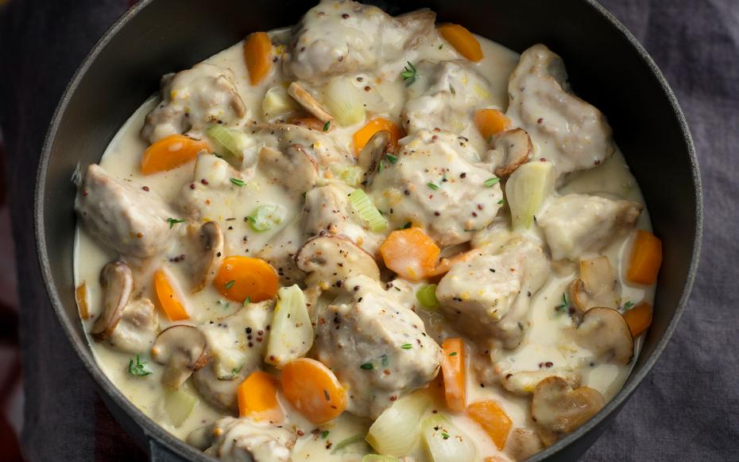

# Blanquette de Veau

*White veal stew: meat poached gently in stock with carrots and aromatics, the cooking liquid then thickened with cream, butter and egg yolks into a velvety pale sauce. Old-school French home cooking; gentle, restorative, the antithesis of a brown braise.*

**Serves:** 4-6

**Prep Time:** 25 minutes

**Cook Time:** 1¾ hours

## Overview
Veal shoulder or breast simmers in white stock with onion, carrot and bouquet garni until tender. The strained stock is reduced and bound with a cream-yolk liaison; mushrooms and pearl onions cooked separately go in at the end. Served with rice or buttered noodles.

## Ingredients

### Veal
- 1 kg veal shoulder or breast (cut into 4 cm cubes)
- 1.5 litres white veal or chicken stock (cold)
- 1 onion (whole, studded with 4 cloves)
- 1 carrot (split lengthways)
- 1 leek (white part)
- 1 bouquet garni (thyme, parsley, bay)
- ½ teaspoon white peppercorns
- Salt

### Garnish
- 200 g pearl onions or small shallots
- 250 g button mushrooms
- 30 g unsalted butter
- 1 tablespoon caster sugar

### Sauce
- 50 g unsalted butter
- 50 g plain flour
- 200 ml double cream
- 2 large egg yolks
- 1 tablespoon lemon juice
- A grating of nutmeg
- Salt and white pepper

## Method

### Stage 1 – Poach the veal
1. Place the veal in a large pan; cover with the cold stock.
1. Bring slowly to the boil. Skim the scum that rises (this is the "white" of blanquette).
1. Add the onion, carrot, leek, bouquet garni and peppercorns. Season lightly.
1. Simmer very gently for 1¼-1½ hours, or until the veal is fork-tender. Don't let it boil hard or the meat firms up.

### Stage 2 – Garnish
1. While the veal cooks, blanch the pearl onions for 2 minutes; peel.
1. Melt 30 g butter in a frying pan. Add the onions, sugar and a splash of water. Cook gently 10-12 minutes until glazed.
1. Add the mushrooms; cook another 5 minutes. Set aside.

### Stage 3 – Make the sauce
1. Lift the veal out and cover; discard the vegetables and bouquet garni. Strain the stock and reduce to about 800 ml over high heat.
1. Melt the 50 g of butter in a clean pan. Whisk in the flour and cook for 1 minute.
1. Pour in the reduced stock gradually, whisking until smooth.
1. Simmer 5 minutes; the sauce should coat the back of a spoon.

### Stage 4 – Liaison
1. Whisk the egg yolks with the cream in a bowl.
1. Ladle a couple of tablespoons of hot sauce into the cream-yolk mixture, whisking (this tempers the eggs).
1. Pour the tempered mixture back into the sauce, whisking. Don't boil after this point or the eggs scramble.
1. Add the lemon juice, nutmeg, salt and white pepper.

### Stage 5 – Combine and serve
1. Return the veal, pearl onions and mushrooms to the sauce. Warm through gently.
1. Serve over plain rice or buttered tagliatelle.

## Notes
- **Skim well, often:** The "white" comes from a clean stock. Don't skip the skimming.
- **Don't boil after the liaison:** Egg yolks scramble at 80°C. Keep the heat very low after they go in.
- **White stock matters:** A standard brown chicken stock will tint the sauce beige. Use a pale homemade stock or a low-colour shop one.

## Storage
- Keeps 2 days refrigerated. Reheat very gently, never boiling.
- Doesn't freeze well; the cream-yolk sauce splits.
