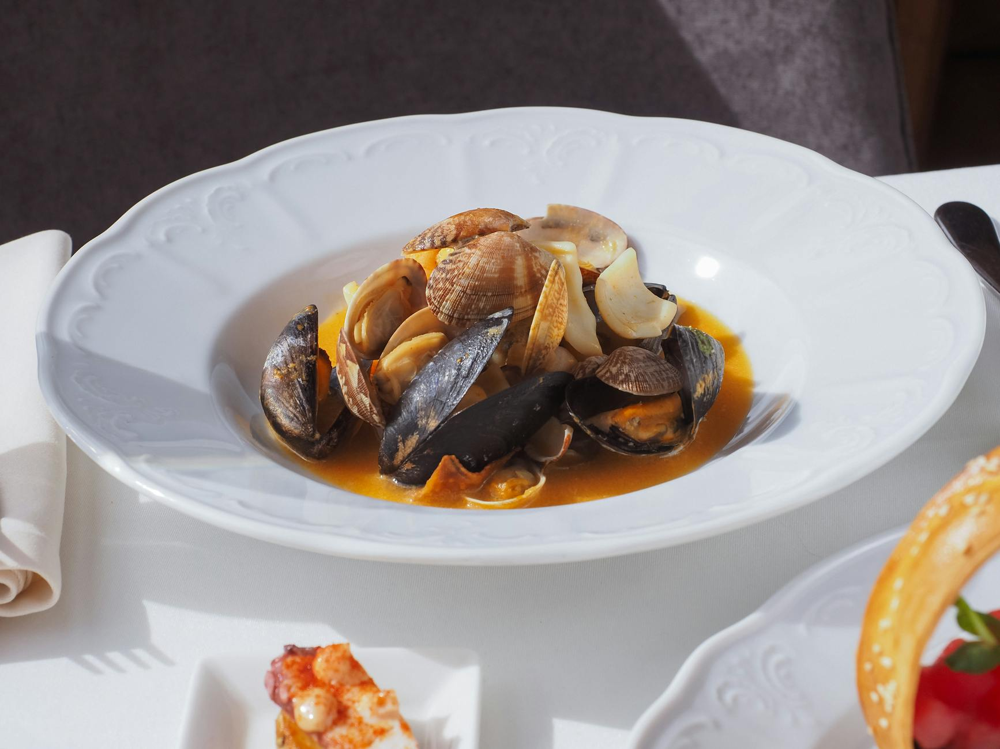

# Bouillabaisse

*Marseille fishermen's stew: a saffron-tomato broth carrying multiple kinds of fish and sometimes shellfish, served with rouille-spread croutons. Built from whatever the catch threw up; what's traditional now was once just whatever was cheap.*

**Serves:** 6

**Prep Time:** 30 minutes

**Cook Time:** 50 minutes

## Overview
A fish stock built from heads and bones is enriched with tomato, fennel, leek, saffron and orange peel. Firm fish go in first, delicate fish later. Rouille (a saffron-garlic mayonnaise) gets spread on toasted baguette and floated on top.

## Ingredients

### Stock
- 1 kg fish heads, bones and trimmings (white fish only)
- 1 leek (white and pale green, sliced)
- 1 fennel bulb (chopped)
- 1 onion (chopped)
- 4 garlic cloves
- 1 tin chopped tomatoes (400 g)
- 2 bay leaves
- A few thyme sprigs
- 1 strip of orange peel
- A pinch of saffron threads
- 1 teaspoon fennel seeds
- 4 tablespoons olive oil
- 200 ml dry white wine
- 1.2 litres water

### Fish (mix and match, 1.5 kg total)
- Firm: monkfish, gurnard, john dory (cut into chunks)
- Medium: red mullet, sea bass (filleted, cut in two)
- Delicate: cod, hake (filleted, cut in two)
- Optional: prawns, mussels

### Rouille
- 1 thick slice white bread (crust off, soaked in stock then squeezed)
- 4 garlic cloves
- 1 small red chilli (seeded)
- 1 egg yolk
- A pinch of saffron
- 200 ml extra virgin olive oil
- Salt

### To serve
- 1 baguette (sliced and toasted)
- 1 garlic clove (for rubbing)

## Method

### Stage 1 – Build the stock
1. Heat the olive oil in a large pan; cook the leek, fennel, onion and garlic for 10 minutes.
1. Add the fish heads/bones, fennel seeds, saffron, orange peel and herbs.
1. Pour in the wine and let it bubble away.
1. Add the tomatoes and water. Simmer 30 minutes.
1. Strain through a fine sieve, pressing hard on the solids. Discard the solids.

### Stage 2 – Rouille
1. Pound the garlic, chilli and saffron to a paste in a mortar (or whizz in a small blender).
1. Add the soaked bread and egg yolk; mix.
1. Drizzle in the olive oil slowly, whisking, until the mixture emulsifies into a thick mayonnaise-like sauce.
1. Season with salt.

### Stage 3 – Cook the fish
1. Bring the strained stock back to a gentle simmer.
1. Add the firm fish; cook 5 minutes.
1. Add medium fish; cook 3 more minutes.
1. Add delicate fish, prawns and mussels; cook 2-3 minutes until everything is just done and the mussels have opened.

### Stage 4 – Serve
1. Rub the toasted baguette slices with garlic.
1. Ladle the stew into bowls; top each with 2-3 toasts and a generous dollop of rouille.

## Notes
- **Mixed fish makes it:** A single-fish version is fish stew, not bouillabaisse. Three or four kinds is the minimum.
- **Stagger the fish by firmness:** Add tougher fish first; delicate flakes go in last so they don't disintegrate.
- **Fishmonger for heads and bones:** Almost always free if you ask; the stock is nothing without them.

## Storage
- Best the day it's made; the fish breaks down on reheating.
- Stock and rouille keep separately 2-3 days refrigerated; cook fresh fish to combine.
