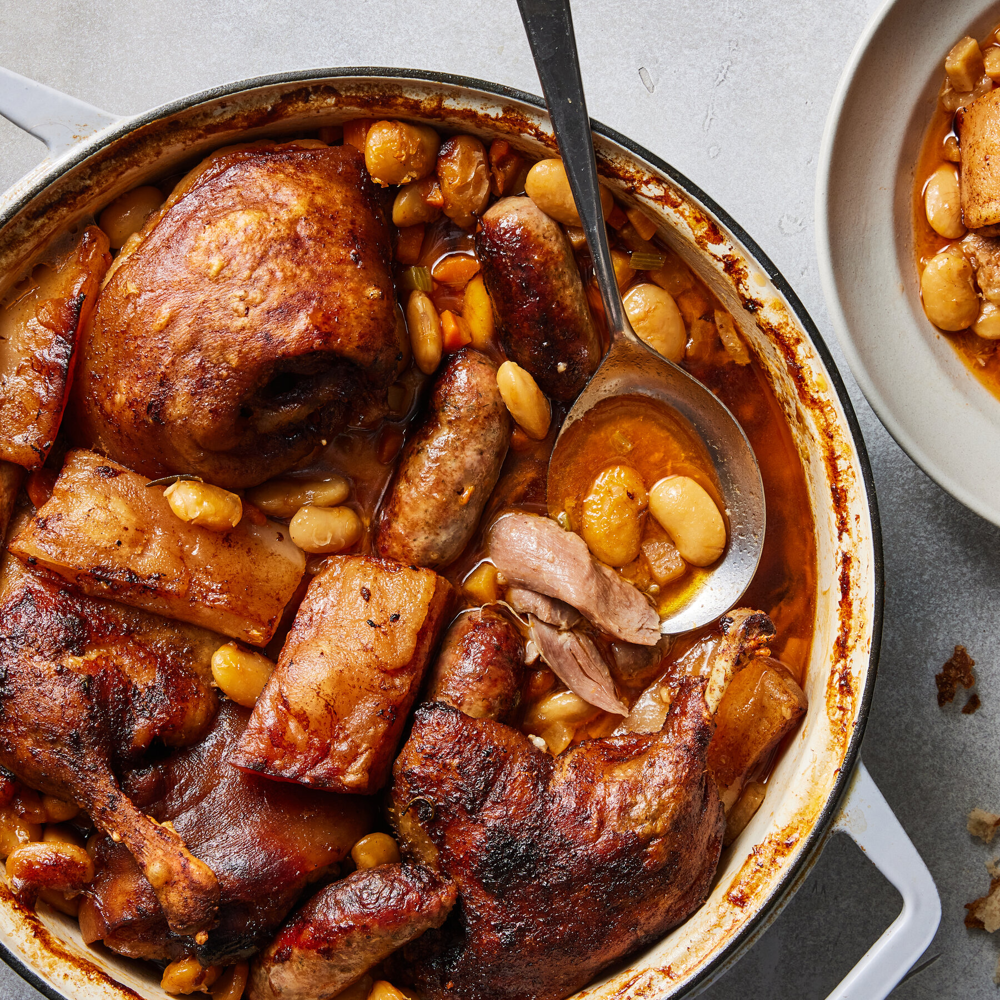

# Cassoulet

*Languedoc bean and meat casserole: white beans cooked with sausage, confit duck, pork shoulder and bacon, baked under a breadcrumb crust that's broken back into the beans repeatedly to build layers. The slow-food showpiece of southwest France; needs a weekend, rewards it.*

**Serves:** 6-8

**Prep Time:** 30 minutes (plus overnight bean soaking)

**Cook Time:** 3-4 hours

## Overview
Dried haricot beans soak overnight, then simmer with bacon and aromatics. Pork shoulder and sausages brown separately. The lot layers in a casserole with confit duck legs, more stock, and a breadcrumb top that cooks into the surface as it bakes long and slow.

## Ingredients

### Beans
- 500 g dried haricot or cannellini beans (soaked overnight)
- 200 g pork belly or pancetta in one piece
- 1 onion (whole, studded with 4 cloves)
- 4 garlic cloves
- 1 bouquet garni
- 1 tablespoon tomato purée
- 1.5 litres chicken or duck stock

### Meats
- 4 confit duck legs (jarred or homemade)
- 4 Toulouse sausages (or coarse pork sausages)
- 600 g boneless pork shoulder (cut into 4 cm cubes)
- 2 tablespoons duck fat (or olive oil)

### Topping
- 100 g coarse breadcrumbs
- 2 tablespoons chopped flat-leaf parsley

## Method

### Stage 1 – Cook the beans
1. Drain the soaked beans. Place in a large pan with the pork belly, clove-studded onion, garlic, bouquet garni and tomato purée.
1. Cover with stock; bring to a simmer.
1. Cook gently for 1½ hours until the beans are tender but still holding their shape.
1. Remove the pork belly, cut into thick cubes; reserve. Discard the onion and bouquet garni.

### Stage 2 – Brown the meats
1. Heat the duck fat in a heavy frying pan.
1. Brown the pork shoulder cubes deeply on all sides; set aside.
1. Brown the sausages until coloured but not cooked through; cut into thirds.
1. Briefly sear the confit duck legs (skin side down) to crisp.

### Stage 3 – Assemble
1. Heat the oven to 160°C (140°C fan).
1. In a wide deep casserole, layer half the beans, then the browned pork, sausage chunks and pork belly cubes, then the remaining beans.
1. Tuck the duck legs in, partially submerged.
1. Pour in enough of the bean liquid to come three-quarters up.
1. Scatter the breadcrumbs evenly over the top.

### Stage 4 – Bake
1. Bake uncovered for 2-2½ hours.
1. Every 30 minutes, break the crust gently with the back of a spoon and push it under, letting a new crust form. Add more bean liquid if drying out.
1. The cassoulet is done when the top has been broken into the beans 3-4 times, the meat is meltingly tender, and the surface is deep golden.

### Stage 5 – Serve
1. Rest for 10 minutes.
1. Sprinkle with parsley. Serve in deep bowls with crusty bread and a sharp green salad.

## Notes
- **The crust ritual:** Breaking the top crust back into the beans three or four times builds the layered, gelatinous texture that defines a real cassoulet. Skip it and you've made bean and sausage casserole.
- **Confit duck makes the dish:** If you can't get jarred confit, slow-roast 4 duck legs covered in salt then in fat for 3 hours at 100°C beforehand.
- **Toulouse sausage:** Coarse, garlicky, traditional. Coarse pork sausages are an acceptable substitute.

## Storage
- Improves overnight. Keeps 3-4 days refrigerated.
- Reheat at 150°C for 40 minutes covered, then 10 uncovered to re-crust.
- Freezes 3 months.
