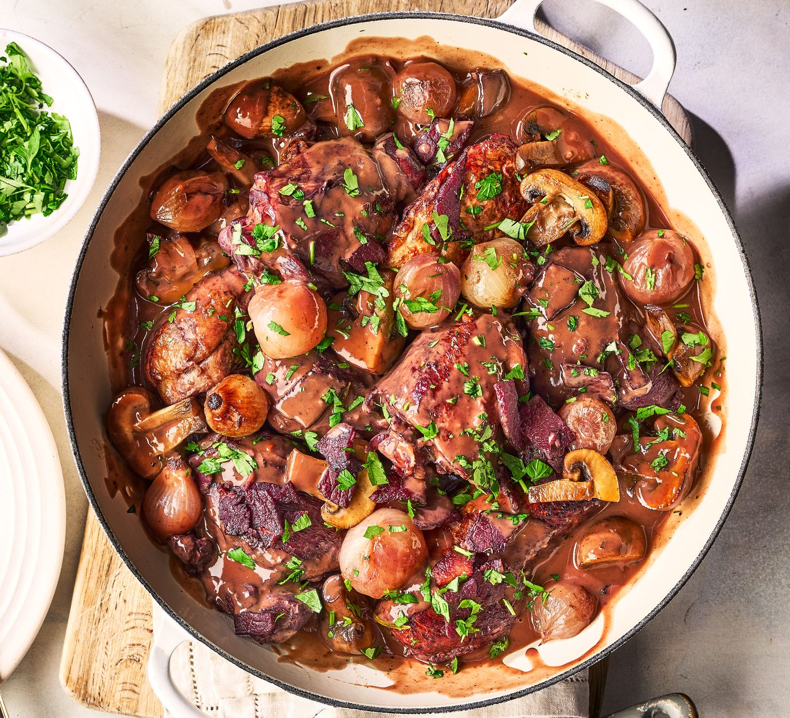

# Coq au Vin

*Burgundian chicken stew: bird braised in red wine with bacon lardons, mushrooms and pearl onions until the sauce is glossy and the meat falls from the bone. Originally a way to redeem a tough old rooster; modern versions use a regular chicken and just braise less.*

**Serves:** 4-6

**Prep Time:** 30 minutes

**Cook Time:** 1¼ hours

## Overview
Lardons rendered, chicken pieces browned in the fat, then simmered in red wine with brandy, stock, garlic, herbs and tomato purée. Mushrooms and pearl onions are sautéed separately and added at the end so they keep their shape and texture.

## Ingredients

### Chicken
- 1 chicken (1.6 kg), cut into 8 pieces (or 6 chicken thighs and 4 drumsticks)
- 2 tablespoons plain flour, seasoned with salt and pepper
- 200 g smoked bacon lardons
- 2 tablespoons olive oil
- 4 garlic cloves (crushed)
- 2 tablespoons tomato purée
- 750 ml red wine (Burgundy or Pinot Noir)
- 50 ml brandy
- 400 ml chicken stock
- 1 bouquet garni (thyme, parsley, bay leaf)
- Salt and freshly ground black pepper

### Garnish
- 30 g unsalted butter
- 200 g pearl onions or shallots (peeled)
- 250 g chestnut mushrooms (halved)
- 2 tablespoons chopped flat-leaf parsley

## Method

### Stage 1 – Render the lardons and brown the chicken
1. Heat the oil in a heavy casserole over medium heat. Cook the lardons until golden and the fat has rendered. Remove with a slotted spoon.
1. Toss the chicken pieces in seasoned flour. Brown in the bacon fat in batches, turning, until deep golden on all sides. Set aside.

### Stage 2 – Build the braise
1. Pour off most of the fat, leaving a couple of tablespoons.
1. Add the garlic and tomato purée; cook 1 minute.
1. Pour in the brandy and let it bubble away for a minute.
1. Add the wine, stock and bouquet garni. Bring to a simmer.
1. Return the chicken and lardons to the pan. Season.
1. Cover and braise on low heat for 45-50 minutes (or transfer to a 160°C oven), until the chicken is tender and almost falling off the bone.

### Stage 3 – Garnish and finish
1. While the chicken braises, melt the butter in a frying pan and brown the pearl onions for 5-6 minutes. Add the mushrooms and cook another 5 minutes. Set aside.
1. Lift the chicken out of the casserole; keep warm.
1. Boil the sauce hard for 5-8 minutes to reduce to a glossy consistency. Discard the bouquet garni.
1. Return the chicken with the onions and mushrooms; warm through.

### Stage 4 – Serve
1. Plate up; scatter parsley over.
1. Serve with mash, buttered noodles or crusty bread.

## Notes
- **Burgundy or Pinot Noir:** A wine you'd drink. Cheap cooking wine produces flat sauce.
- **Brandy adds depth:** Optional but makes a difference; a splash of cognac or armagnac if you have it.
- **Garnish at the end:** Mushrooms and onions cooked the whole braise turn flabby. Sauté separately and add late.

## Storage
- Improves overnight. Keeps 3 days refrigerated.
- Freezes well for 2 months; the garnish will soften, but flavour is preserved.
