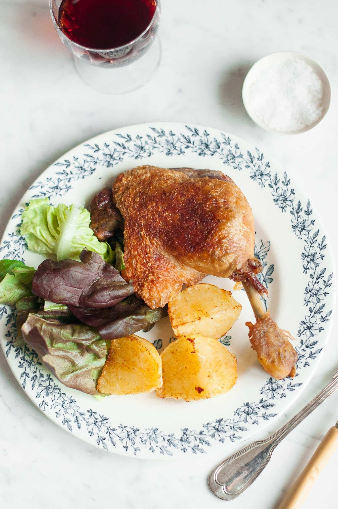

# Duck Confit

*Duck legs cured in salt, then cooked submerged in their own rendered fat at low temperature for hours until the meat is meltingly tender. Cooled in the fat, then crisped in a hot pan to serve. Originally a southwest French preservation method; now the most luxurious thing you can make from a duck leg.*

**Serves:** 4

**Prep Time:** 24 hours cure (active 15 minutes)

**Cook Time:** 3 hours (oven) plus 8 minutes pan-crisp

## Overview
Duck legs sit overnight under salt, garlic and herbs to season and draw out moisture. They then cook completely submerged in duck fat at 90°C for 3 hours. The cooked legs and the fat keep for weeks. To serve, lift legs from the fat and crisp the skin in a dry hot pan.

## Ingredients

### Cure
- 4 duck legs
- 2 tablespoons coarse sea salt
- 4 garlic cloves (smashed)
- 4 thyme sprigs
- 1 teaspoon black peppercorns (crushed)
- 2 bay leaves (torn)

### To cook
- 1 kg duck fat (1-2 jars; or rendered from duck trimmings)

## Method

### Stage 1 – Cure (overnight)
1. Mix the salt, garlic, thyme, peppercorns and bay in a bowl.
1. Rub the cure all over the duck legs, especially into the skin.
1. Place the legs on a tray, cover and refrigerate 24 hours.

### Stage 2 – Rinse and dry
1. Brush off all the salt and aromatics. Wipe the legs dry with kitchen paper.
1. Heat the oven to 90°C (no fan).

### Stage 3 – Cook in fat
1. Melt the duck fat in an ovenproof casserole over low heat until liquid.
1. Add the duck legs; they should be completely submerged. Top up with more fat if needed.
1. Cover and transfer to the oven; cook for 3 hours, until a knife slides into the meat with no resistance.
1. Cool the legs in the fat. (At this point they keep, fat-submerged in a sealed container, for 2-3 weeks refrigerated.)

### Stage 4 – Crisp and serve
1. Lift the legs out of the fat (scrape off most of it; don't worry about removing it all).
1. Heat a dry heavy pan over medium heat.
1. Place the legs skin-side down and cook 6-8 minutes without moving until the skin is shatteringly crisp.
1. Turn for 1 minute to warm through.

## Notes
- **Cure time:** 24 hours is enough; longer (up to 36) doesn't hurt. Less than 12 and the meat won't season properly.
- **90°C oven, not boiling fat:** The fat shouldn't bubble; this is gentle confit, not deep-frying.
- **Don't waste the fat:** Strain and save. Reuse for the next confit, or for the world's best roast potatoes.

## Serving
Serve with: Lentils du Puy, sautéed potatoes, or simple bitter greens.
Garnish with: Flaky salt and a wedge of orange.

## Storage
- Submerged in fat in a clean sealed container, the legs keep 2-3 weeks refrigerated, several months in the freezer.
- Once crisped, eat immediately.
