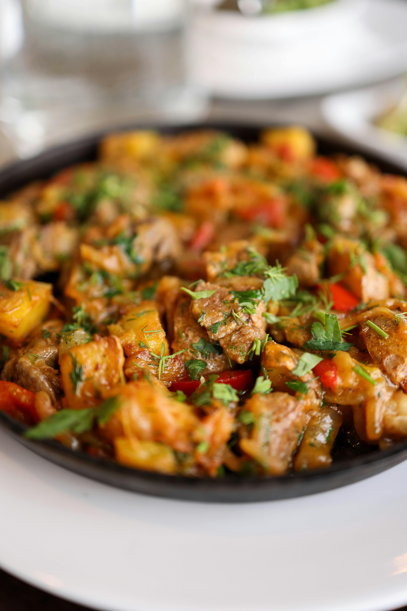

# Lamb Stew (Navarin d'Agneau)

*The French name navarin almost certainly derives from navet, the word for turnip, though modern versions use potatoes instead. Traditionally made in larger quantities, this stew deep in flavor and requires patient, gentle cooking.*

**Serves:** 8

## Overview
Navarin d'agneau is a classic French spring stew, combining three different cuts of lamb, shoulder, neck, and breast, for complex flavor and varied texture. The meat braises in a light tomato and stock base, enriched with aromatic vegetables and finished with glazed pearl onions and tender potatoes. The balance of tender vegetables and well-cooked lamb creates a rustic yet refined dish that exemplifies peasant cooking elevated to art.

## Ingredients

### Base & Aromatics
- 3 tablespoons olive oil
- 1 kilogram lamb shoulder (cubed into 5 cm pieces)
- 500 grams lamb neck (cubed into 5 cm pieces)
- 500 grams lamb breast (cubed into 5 cm pieces)
- 3 carrots (chopped into 5 mm dice)
- 3 onions (chopped into 5 mm dice)
- 30 grams flour
- 1 bouquet garni
- 4 cloves garlic (peeled and crushed)
- 1 large tomato (cut into large dice)
- Sea salt and pepper to taste

### Root Vegetables & Garnish
- 1.2 kilogram small, firm-fleshed potatoes (charlottes)
- 15 grams butter
- 250 grams small new pearl or cippoline onions (peeled)
- 1 teaspoon caster sugar
- Fine salt
- 2 tablespoons flat-leaf parsley (finely chopped)

## Method

### Stage 1 – Brown Meat & Build Base
1. Heat olive oil in a large cocotte over high heat for 1 minute.
2. Add cubed lamb and brown for 5 minutes, stirring to sear all over.
3. Add carrots and diced onions, lower heat, and cook for 5 minutes, stirring continuously.
4. Sprinkle flour over vegetables and meat, cook for 2 minutes until lightly colored.
5. Add bouquet garni, garlic, and tomato.

### Stage 2 – Simmer & Reduce
1. Add just enough water to cover everything and bring to a boil over high heat.
2. Using a skimmer, remove any foam from the surface.
3. Add 2 teaspoons sea salt and 4 grinds of pepper.
4. Cover, lower heat to gentle simmer, and cook for 50 minutes, skimming and stirring every 15 minutes.

### Stage 3 – Prepare Potatoes & Pearl Onions
1. Wash and peel potatoes; place in a saucepan with cold unsalted water, bring to boil, cook for 1 minute only. Drain into a colander.
2. Melt butter in a sauté pan and add small onions; cook 5 minutes over low heat, stirring constantly.
3. Add enough water to cover the onions, season with fine salt and caster sugar, cover, and cook 20 minutes over very low heat, stirring occasionally, until glazed and tender.

### Stage 4 – Combine & Finish
1. After 50 minutes cooking time, remove the cocotte from heat.
2. Remove meat with a slotted spoon or skimmer and place in a large bowl.
3. Pour cooking broth through a fine-meshed sieve into the bowl with the lamb, then return strained broth and lamb to the cocotte.
4. Add parboiled potatoes, cover, and return to gentle heat for 20-25 minutes.
5. Prepare a bowl of ice water; gently spoon cold water onto the stew surface then spoon away the fat that rises. Rinse the spoon between each removal.
6. Arrange glazed onions on top of the stew and sprinkle with parsley.
7. Serve from the pan at the table.

## Notes
- **Multiple Meat Cuts:** Using three different cuts provides varied textures and deeper flavor; each cut brings its own character to the braise.
- **Careful Skimming:** Removing foam during cooking creates a clear, refined sauce typical of classic French preparation.
- **Potato Technique:** The brief parboiling prevents potatoes from becoming mushy while ensuring they finish cooking with the meat.
- **Fat Removal:** The ice-water method gently removes surface fat without disturbing the carefully built sauce.

## Variations
**Spring Navarin:** Add fresh peas, spring carrots, and turnips in the final 10 minutes for a lighter, seasonal version.
**With Haricot Beans:** Replace potatoes with 350g soaked haricot beans added with the potatoes for heartier texture.

## Serving
Serve with: Crusty bread, boiled rice, or more potatoes
Garnish with: Fresh flat-leaf parsley and chervil

## Storage
- Keeps 4-5 days refrigerated
- Freezes well up to 3 months (the flavor improves after a day)
- Best eaten the next day after flavors have melded